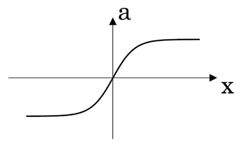
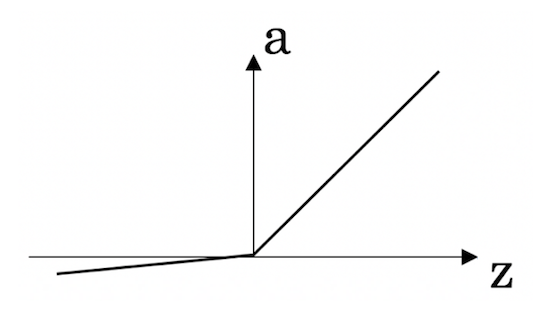

## Course A - Neural Networks and Deep Learning

## Week 1 - Introduction to deep learning

1. **What does the analogy “AI is the new electricity” refer to?**

- [x] Similar to electricity starting about 100 years ago, AI is transforming multiple industries.

- [ ] AI is powering personal devices in our homes and offices, similar to electricity.

- [ ] AI runs on computers and is thus powered by electricity, but it is letting computers do things not possible before.

- [ ] Through the “smart grid”, AI is delivering a new wave of electricity.

```
Correct
Yes. AI is transforming many fields from the car industry to agriculture to supply-chain...
```

<br>

2. **Which of these are reasons for Deep Learning recently taking off? (Check the three options that apply.)**

- [x] We have access to a lot more computational power.

```
Correct
Yes! The development of hardware, perhaps especially GPU computing, has significantly improved deep learning algorithms' performance.
```

- [x] Deep learning has resulted in significant improvements in important applications such as online advertising, speech recognition, and image recognition.

```
Correct
These were all examples discussed in lecture 3.
```

- [x] We have access to a lot more data.

```
Correct
Yes! The digitalization of our society has played a huge role in this.
```

- [ ] Neural Networks are a brand new field.

<br>

3. **Recall this diagram of iterating over different ML ideas. Which of the statements below are true? (Check all that apply.)**


- [x] Being able to try out ideas quickly allows deep learning engineers to iterate more quickly.

```
Correct
Yes, as discussed in Lecture 4.
```

- [x] Faster computation can help speed up how long a team takes to iterate to a good idea.

```
Correct
Yes, as discussed in Lecture 4.
```

- [ ] It is faster to train on a big dataset than a small dataset.

- [x] Recent progress in deep learning algorithms has allowed us to train good models faster (even without changing the CPU/GPU hardware).

```
Correct
Yes. For example, we discussed how switching from sigmoid to ReLU activation functions allows faster training.
```

<br>

4. **When an experienced deep learning engineer works on a new problem, they can usually use insight from previous problems to train a good model on the first try, without needing to iterate multiple times through different models. True/False?**

- [ ] True

- [x] False

```
Correct
Yes. Finding the characteristics of a model is key to have good performance. Although experience can help, it requires multiple iterations to build a good model.
```

<br>

5. **Which one of these plots represents a ReLU activation function?**

- [ ] Figure 1:

- [ ] Figure 2:

- [x] Figure 3:

- [ ] Figure 4:

```
Correct
Correct! This is the ReLU activation function, the most used in neural networks.
```

<br>

6. **Images for cat recognition is an example of “structured” data, because it is represented as a structured array in a computer. True/False?**

- [ ] True

- [x] False
```
Correct
Yes. Images for cat recognition is an example of “unstructured” data.
```

<br>

7. **A demographic dataset with statistics on different cities' population, GDP per capita, economic growth is an example of “unstructured” data because it contains data coming from different sources. True/False?**

- [ ] True

- [x] False

```
Correct
A demographic dataset with statistics on different cities' population, GDP per capita, economic growth is an example of “structured” data by opposition to image, audio or text datasets.
```

<br>

8. **Why is an RNN (Recurrent Neural Network) used for machine translation, say translating English to French? (Check all that apply.)**

- [x] It can be trained as a supervised learning problem.

```
Correct
Yes. We can train it on many pairs of sentences x (English) and y (French).
```

- [ ] It is strictly more powerful than a Convolutional Neural Network (CNN).

- [x] It is applicable when the input/output is a sequence (e.g., a sequence of words).

```
Correct
Yes. An RNN can map from a sequence of english words to a sequence of french words.
```

- [ ] RNNs represent the recurrent process of Idea->Code->Experiment->Idea->....

<br>

9. **In this diagram which we hand-drew in lecture, what do the horizontal axis (x-axis) and vertical axis (y-axis) represent?**


- [ ] x-axis is the input to the algorithmy-axis is outputs.

- [x] x-axis is the amount of datay-axis (vertical axis) is the performance of the algorithm.

- [ ] x-axis is the amount of datay-axis is the size of the model you train.

- [ ] x-axis is the performance of the algorithmy-axis (vertical axis) is the amount of data.

```
Correct
```

<br>

10. **Assuming the trends described in the previous question's figure are accurate (and hoping you got the axis labels right), which of the following are true? (Check all that apply.)**

- [ ] Decreasing the training set size generally does not hurt an algorithm’s performance, and it may help significantly.

- [ ] Decreasing the size of a neural network generally does not hurt an algorithm’s performance, and it may help significantly.

- [x] Increasing the training set size generally does not hurt an algorithm’s performance, and it may help significantly.

```
Correct
Yes. Bringing more data to a model is almost always beneficial.
```

- [x] Increasing the size of a neural network generally does not hurt an algorithm’s performance, and it may help significantly.

```
Correct
Yes. According to the trends in the figure above, big networks usually perform better than small networks.
```
