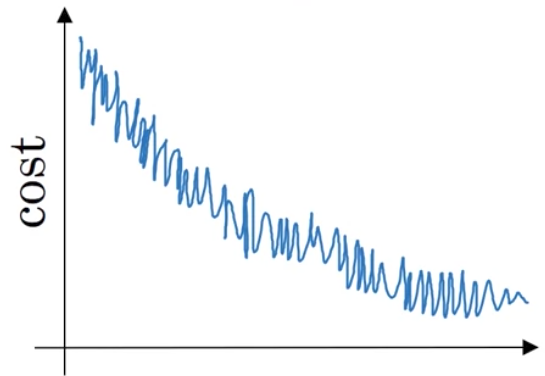
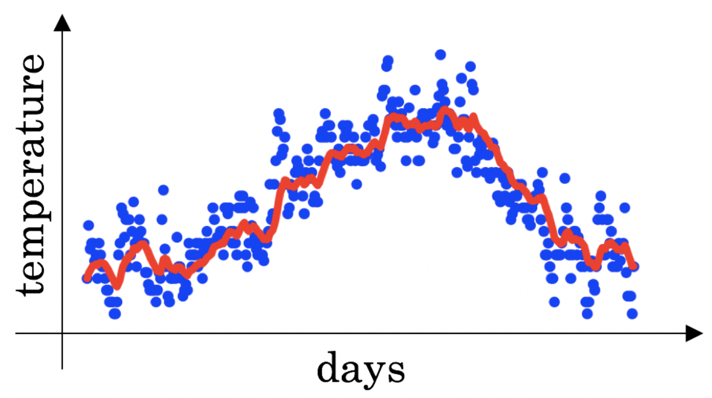
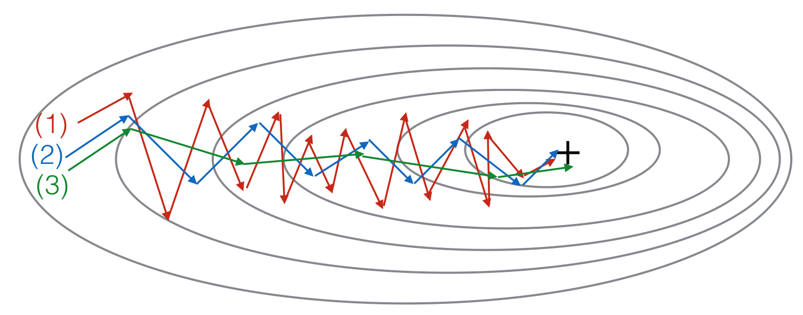

## Course B - Improving Deep Neural Networks

## Week 2 - Optimization algorithms

1. Which notation would you use to denote the 3rd layer’s activations when the input is the 7th example from the 8th minibatch?

- [ ] a[8]{7}(3)

- [x] a[3]{8}(7)

- [ ] a[8]{3}(7)

- [ ] a[3]{7}(8)

```
Correct
```

2. Which of these statements about mini-batch gradient descent do you agree with?

- [ ] Training one epoch (one pass through the training set) using mini-batch gradient descent is faster than training one epoch using batch gradient descent.

- [ ] You should implement mini-batch gradient descent without an explicit for-loop over different mini-batches, so that the algorithm processes all mini-batches at the same time (vectorization).

- [x] One iteration of mini-batch gradient descent (computing on a single mini-batch) is faster than one iteration of batch gradient descent.

```
Correct
```

3. Why is the best mini-batch size usually not 1 and not m, but instead something in-between?

- [ ] If the mini-batch size is m, you end up with stochastic gradient descent, which is usually slower than mini-batch gradient descent.

- [x] If the mini-batch size is m, you end up with batch gradient descent, which has to process the whole training set before making progress.

```
Correct
```

- [x] If the mini-batch size is 1, you lose the benefits of vectorization across examples in the mini-batch.

```
Correct
```

- [ ] If the mini-batch size is 1, you end up having to process the entire training set before making any progress.


4. Suppose your learning algorithm’s cost JJ, plotted as a function of the number of iterations, looks like this:

   

   Which of the following do you agree with?

- [ ] Whether you’re using batch gradient descent or mini-batch gradient descent, something is wrong.

- [ ] Whether you’re using batch gradient descent or mini-batch gradient descent, this looks acceptable.

- [x] If you’re using mini-batch gradient descent, this looks acceptable. But if you’re using batch gradient descent, something is wrong.

- [ ] If you’re using mini-batch gradient descent, something is wrong. But if you’re using batch gradient descent, this looks acceptable.

```
Correct
```

5. Suppose the temperature in Casablanca over the first three days of January are the same:

   - Jan 1st: \theta_1 = 10^o Cθ 
   - Jan 2nd: \theta_2 10^o Cθ 
     (We used Fahrenheit in lecture, so will use Celsius here in honor of the metric world.)

   Say you use an exponentially weighted average with \beta = 0.5β=0.5 to track the temperature: v_0  =0, v_t = \beta v_{t-1} +(1-\beta)\theta_tv =βv t−1 +(1−β)θt If v_2v 2 is the value computed after day 2 without bias correction, and v_2^{corrected}v 2 corrected  is the value you compute with bias correction. What are these values? (You might be able to do this without a calculator, but you don't actually need one. Remember what is bias correction doing.)
- [ ] v_2 = 7.5 v2corrected=7.5

- [ ] v_2 = 10 v2corrected=10

- [ ] v_2 = 10 v2corrected=7.5

- [x] v_2 = 7.5 v2corrected=10

```
Correct
```
6. Which of these is NOT a good learning rate decay scheme? Here, t is the epoch number.

- [ ] \alpha = \frac{1}{1+2*t} \alpha_0α= 

- [ ] \alpha = \frac{1}{\sqrt{t}} \alpha_0α= 

- [x] \alpha = e^t \alpha_0 α=e 

- [ ] - [ ] \alpha = 0.95^t \alpha_0 α=0.95 

```
Correct
```

7. You use an exponentially weighted average on the London temperature dataset. You use the following to track the temperature: v_{t} = \beta v_{t-1} + (1-\beta)\theta_tv   The red line below was computed using \beta = 0.9β=0.9. What would happen to your red curve as you vary \betaβ? (Check the two that apply)

   

- [ ] Decreasing \betaβ will shift the red line slightly to the right.

- [x] Increasing \betaβ will shift the red line slightly to the right.

```
Correct
True, remember that the red line corresponds to \beta = 0.9β=0.9. In lecture we had a green line $$\beta = 0.98) that is slightly shifted to the right.
```

- [x] Decreasing \betaβ will create more oscillation within the red line.

```
Correct
True, remember that the red line corresponds to \beta = 0.9β=0.9. In lecture we had a yellow line $$\beta = 0.98 that had a lot of oscillations.
```

- [ ] Increasing \betaβ will create more oscillations within the red line.

8. Consider this figure:

   

   These plots were generated with gradient descent; with gradient descent with momentum (\betaβ = 0.5) and gradient descent with momentum (\betaβ = 0.9). Which curve corresponds to which algorithm?

- [ ] (1) is gradient descent with momentum (small \betaβ), (2) is gradient descent with momentum (small \betaβ), (3) is gradient descent

- [x] (1) is gradient descent. (2) is gradient descent with momentum (small \betaβ). (3) is gradient descent with momentum (large \betaβ)

- [ ] (1) is gradient descent with momentum (small \betaβ). (2) is gradient descent. (3) is gradient descent with momentum (large \betaβ)

- [ ] (1) is gradient descent. (2) is gradient descent with momentum (large \betaβ) . (3) is gradient descent with momentum (small \betaβ)

```
Correct
```

9. Suppose batch gradient descent in a deep network is taking excessively long to find a value of the parameters that achieves a small value for the cost function J(W[1],b[1],...,W[L],b[L]). Which of the following techniques could help find parameter values that attain a small value forJ? (Check all that apply)

- [x] Try mini-batch gradient descent

```
Correct
```

- [x] Try better random initialization for the weights

```
Correct
```

- [x] Try tuning the learning rate \alphaα

```
Correct
```

- [x] Try using Adam

```
Correct
```

- [ ] Try initializing all the weights to zero

10. Which of the following statements about Adam is False?

- [ ] The learning rate hyperparameter \alphaα in Adam usually needs to be tuned.

- [x] Adam should be used with batch gradient computations, not with mini-batches.

- [ ] Adam combines the advantages of RMSProp and momentum

- [ ] We usually use “default” values for the hyperparameters \beta_1, \beta_2β  and ε in Adam (\beta_1 = 0.9β  =0.9, \beta_2 = 0.999β  =0.999, ε=10−8)

```
Correct
```
