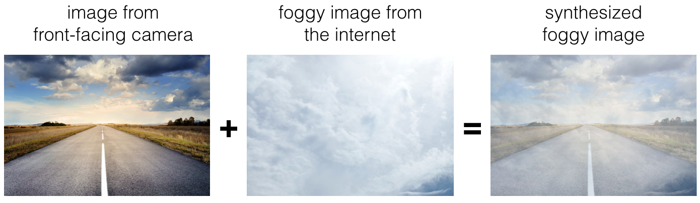

## Course C - Structuring Machine Learning Projects

## Week 2 - ML Strategy (2)

1. **To help you practice strategies for machine learning, in this week we’ll present another scenario and ask how you would act. We think this “simulator” of working in a machine learning project will give a task of what leading a machine learning project could be like!**

   **You are employed by a startup building self-driving cars. You are in charge of detecting road signs (stop sign, pedestrian crossing sign, construction ahead sign) and traffic signals (red and green lights) in images. The goal is to recognize which of these objects appear in each image. As an example, the above image contains a pedestrian crossing sign and red traffic lights**

   

   **Your 100,000 labeled images are taken using the front-facing camera of your car. This is also the distribution of data you care most about doing well on. You think you might be able to get a much larger dataset off the internet, that could be helpful for training even if the distribution of internet data is not the same.**

   **You are just getting started on this project. What is the first thing you do? Assume each of the steps below would take about an equal amount of time (a few days).**

- [x] Spend a few days training a basic model and see what mistakes it makes.

- [ ] Spend a few days getting the internet data, so that you understand better what data is available.

- [ ] Spend a few days checking what is human-level performance for these tasks so that you can get an accurate estimate of Bayes error.

- [ ] Spend a few days collecting more data using the front-facing camera of your car, to better understand how much data per unit time you can collect.

```
Correct
As discussed in lecture, applied ML is a highly iterative process. If you train a basic model and carry out error analysis (see what mistakes it makes) it will help point you in more promising directions.
```

2. **Your goal is to detect road signs (stop sign, pedestrian crossing sign, construction ahead sign) and traffic signals (red and green lights) in images. The goal is to recognize which of these objects appear in each image. You plan to use a deep neural network with ReLU units in the hidden layers.**

   **For the output layer, a softmax activation would be a good choice for the output layer because this is a multi-task learning problem. True/False?**

- [ ] True

- [x] False

```
Correct
Softmax would be a good choice if one and only one of the possibilities (stop sign, speed bump, pedestrian crossing, green light and red light) was present in each image.
```

3. **You are carrying out error analysis and counting up what errors the algorithm makes. Which of these datasets do you think you should manually go through and carefully examine, one image at a time?**

- [ ] 10,000 images on which the algorithm made a mistake

- [ ] 10,000 randomly chosen images

- [x] 500 images on which the algorithm made a mistake

- [ ] 500 randomly chosen images

```
Correct
Focus on images that the algorithm got wrong. Also, 500 is enough to give you a good initial sense of the error statistics. There’s probably no need to look at 10,000, which will take a long time.
```

4. **After working on the data for several weeks, your team ends up with the following data:**

   - **100,000 labeled images taken using the front-facing camera of your car.**
   - **900,000 labeled images of roads downloaded from the internet.**
   - **Each image’s labels precisely indicate the presence of any specific road signs and traffic signals or combinations of them. For example, y(i) = ⎡⎣⎢⎢⎢⎢10010⎤⎦⎥⎥⎥⎥ means the image contains a stop sign and a red traffic light.**

   **Because this is a multi-task learning problem, you need to have all your y(i) vectors fully labeled. If one example is equal to ⎡⎣⎢⎢⎢⎢0?11?⎤⎦⎥⎥⎥⎥ then the learning algorithm will not be able to use that example. True/False?**

- [ ] True

- [x] False

```
Correct
As seen in the lecture on multi-task learning, you can compute the cost such that it is not influenced by the fact that some entries haven’t been labeled.
```

5. **The distribution of data you care about contains images from your car’s front-facing camera; which comes from a different distribution than the images you were able to find and download off the internet. How should you split the dataset into train/dev/test sets?**

- [x] Choose the training set to be the 900,000 images from the internet along with 80,000 images from your car’s front-facing camera. The 20,000 remaining images will be split equally in dev and test sets.

- [ ] Mix all the 100,000 images with the 900,000 images you found online. Shuffle everything. Split the 1,000,000 images dataset into 980,000 for the training set, 10,000 for the dev set and 10,000 for the test set.

- [ ] Choose the training set to be the 900,000 images from the internet along with 20,000 images from your car’s front-facing camera. The 80,000 remaining images will be split equally in dev and test sets.

- [ ] Mix all the 100,000 images with the 900,000 images you found online. Shuffle everything. Split the 1,000,000 images dataset into 600,000 for the training set, 200,000 for the dev set and 200,000 for the test set.

```
Correct
Yes. As seen in lecture, it is important that your dev and test set have the closest possible distribution to “real”-data. It is also important for the training set to contain enough “real”-data to avoid having a data-mismatch problem.
```

6. **Assume you’ve finally chosen the following split between of the data:**

   | **Dataset:** | **Contains:**                                                | **Error of the algorithm:** |
| ------------ | ------------------------------------------------------------ | --------------------------- |
| Training     | 940,000 images randomly picked from (900,000 internet images + 60,000 car’s front-facing camera images) | 8.8%                        |
| Training-Dev | 20,000 images randomly picked from (900,000 internet images + 60,000 car’s front-facing camera images) | 9.1%                        |
| Dev          | 20,000 images from your car’s front-facing camera            | 14.3%                       |
| Test         | 20,000 images from the car’s front-facing camera             | 14.8%                       |

   **You also know that human-level error on the road sign and traffic signals classification task is around 0.5%. Which of the following are True? (Check all that apply).**

- [ ] You have a large variance problem because your model is not generalizing well to data from the same training distribution but that it has never seen before.

- [x] You have a large avoidable-bias problem because your training error is quite a bit higher than the human-level error.

```
Correct
```

- [x] You have a large data-mismatch problem because your model does a lot better on the training-dev set than on the dev set

```
Correct
```

- [ ] You have a large variance problem because your training error is quite higher than the human-level error.

- [ ] Your algorithm overfits the dev set because the error of the dev and test sets are very close.

7. **Based on table from the previous question, a friend thinks that the training data distribution is much easier than the dev/test distribution. What do you think?**

- [ ] Your friend is right. (I.e., Bayes error for the training data distribution is probably lower than for the dev/test distribution.)

- [ ] Your friend is wrong. (I.e., Bayes error for the training data distribution is probably higher than for the dev/test distribution.)

- [x] There’s insufficient information to tell if your friend is right or wrong.

```
Correct
The algorithm does better on the distribution of data it trained on. But you don’t know if it’s because it trained on that no distribution or if it really is easier. To get a better sense, measure human-level error separately on both distributions.
```

8. **You decide to focus on the dev set and check by hand what are the errors due to. Here is a table summarizing your discoveries:**

   | Overall dev set error                                        | 15.3% |
| ------------------------------------------------------------ | ----- |
| Errors due to incorrectly labeled data                       | 4.1%  |
| Errors due to foggy pictures                                 | 8.0%  |
| Errors due to rain drops stuck on your car’s front-facing camera | 2.2%  |
| Errors due to other causes                                   | 1.0%  |

   **In this table, 4.1%, 8.0%, etc. are a fraction of the total dev set (not just examples your algorithm mislabeled). For example, about 8.0/15.3 = 52% of your errors are due to foggy pictures.**

   **The results from this analysis implies that the team’s highest priority should be to bring more foggy pictures into the training set so as to address the 8.0% of errors in that category. True/False?**

   **Additional Note: there are subtle concepts to consider with this question, and you may find arguments for why some answers are also correct or incorrect. We recommend that you spend time reading the feedback for this quiz, to understand what issues that you will want to consider when you are building your own machine learning project.**

- [ ] True because it is the largest category of errors. We should always prioritize the largest category of error as this will make the best use of the team's time.

- [ ] True because it is greater than the other error categories added together (8.0 > 4.1+2.2+1.0).

- [x] False because it depends on how easy it is to add foggy data. If foggy data is very hard and costly to collect, it might not be worth the team’s effort.

- [ ] First start with the sources of error that are least costly to fix.

```
Correct
correct: feedback: This is the correct answer. You should consider the tradeoff between the data accessibility and potential improvement of your model trained on this additional data.
```

9. **You can buy a specially designed windshield wiper that help wipe off some of the raindrops on the front-facing camera. Based on the table from the previous question, which of the following statements do you agree with?**

- [x] 2.2% would be a reasonable estimate of the maximum amount this windshield wiper could improve performance.

- [ ] 2.2% would be a reasonable estimate of the minimum amount this windshield wiper could improve performance.

- [ ] 2.2% would be a reasonable estimate of how much this windshield wiper will improve performance.

- [ ] 2.2% would be a reasonable estimate of how much this windshield wiper could worsen performance in the worst case.

```
Correct
Yes. You will probably not improve performance by more than 2.2% by solving the raindrops problem. If your dataset was infinitely big, 2.2% would be a perfect estimate of the improvement you can achieve by purchasing a specially designed windshield wiper that removes the raindrops.
```

10. **You decide to use data augmentation to address foggy images. You find 1,000 pictures of fog off the internet, and “add” them to clean images to synthesize foggy days, like this:**

    

    **Which of the following statements do you agree with?**

- [ ] There is little risk of overfitting to the 1,000 pictures of fog so long as you are combing it with a much larger (>>1,000) of clean/non-foggy images.

- [x] So long as the synthesized fog looks realistic to the human eye, you can be confident that the synthesized data is accurately capturing the distribution of real foggy images (or a subset of it), since human vision is very accurate for the problem you’re solving.

- [ ] Adding synthesized images that look like real foggy pictures taken from the front-facing camera of your car to training dataset won’t help the model improve because it will introduce avoidable-bias.

```
Correct
Yes. If the synthesized images look realistic, then the model will just see them as if you had added useful data to identify road signs and traffic signals in a foggy weather. I will very likely help.
```

11. **After working further on the problem, you’ve decided to correct the incorrectly labeled data on the dev set. Which of these statements do you agree with? (Check all that apply).**

- [x] You should also correct the incorrectly labeled data in the test set, so that the dev and test sets continue to come from the same distribution

```
Correct
Yes because you want to make sure that your dev and test data come from the same distribution for your algorithm to make your team’s iterative development process is efficient.
```

- [ ] You should correct incorrectly labeled data in the training set as well so as to avoid your training set now being even more different from your dev set.

- [ ] You should not correct the incorrectly labeled data in the test set, so that the dev and test sets continue to come from the same distribution

- [x] You do not necessarily need to fix the incorrectly labeled data in the training set, because it's okay for the training set distribution to differ from the dev and test sets. Note that it is important that the dev set and test set have the same distribution.

```
Correct
True, deep learning algorithms are quite robust to having slightly different train and dev distributions.
```

12. **So far your algorithm only recognizes red and green traffic lights. One of your colleagues in the startup is starting to work on recognizing a yellow traffic light. (Some countries call it an orange light rather than a yellow light; we’ll use the US convention of calling it yellow.) Images containing yellow lights are quite rare, and she doesn’t have enough data to build a good model. She hopes you can help her out using transfer learning.**

    **What do you tell your colleague?**

- [x] She should try using weights pre-trained on your dataset, and fine-tuning further with the yellow-light dataset.

- [ ] If she has (say) 10,000 images of yellow lights, randomly sample 10,000 images from your dataset and put your and her data together. This prevents your dataset from “swamping” the yellow lights dataset.

- [ ] You cannot help her because the distribution of data you have is different from hers, and is also lacking the yellow label.

- [ ] Recommend that she try multi-task learning instead of transfer learning using all the data.

```
Correct
Yes. You have trained your model on a huge dataset, and she has a small dataset. Although your labels are different, the parameters of your model have been trained to recognize many characteristics of road and traffic images which will be useful for her problem. This is a perfect case for transfer learning, she can start with a model with the same architecture as yours, change what is after the last hidden layer and initialize it with your trained parameters.
```

13. **Another colleague wants to use microphones placed outside the car to better hear if there’re other vehicles around you. For example, if there is a police vehicle behind you, you would be able to hear their siren. However, they don’t have much to train this audio system. How can you help?**

- [ ] Transfer learning from your vision dataset could help your colleague get going faster. Multi-task learning seems significantly less promising.

- [ ] Multi-task learning from your vision dataset could help your colleague get going faster. Transfer learning seems significantly less promising.

- [ ] Either transfer learning or multi-task learning could help our colleague get going faster.

- [x] Neither transfer learning nor multi-task learning seems promising.

```
Correct
Yes. The problem he is trying to solve is quite different from yours. The different dataset structures make it probably impossible to use transfer learning or multi-task learning.
```

14. **To recognize red and green lights, you have been using this approach:**

    - ***(A)* Input an image (x) to a neural network and have it directly learn a mapping to make a prediction as to whether there’s a red light and/or green light (y).**

    **A teammate proposes a different, two-step approach:**

    - ***(B)* In this two-step approach, you would first (i) detect the traffic light in the image (if any), then (ii) determine the color of the illuminated lamp in the traffic light.**

    **Between these two, Approach B is more of an end-to-end approach because it has distinct steps for the input end and the output end. True/False?**

- [ ] True

- [x] False

```
Correct
Yes. (A) is an end-to-end approach as it maps directly the input (x) to the output (y).
```

15. **Approach A (in the question above) tends to be more promising than approach B if you have a ____ (fill in the blank).**

- [x] Large training set

- [ ] Multi-task learning problem.

- [ ] Large bias problem.

- [ ] Problem with a high Bayes error.

```
Correct
Yes. In many fields, it has been observed that end-to-end learning works better in practice, but requires a large amount of data.
```
