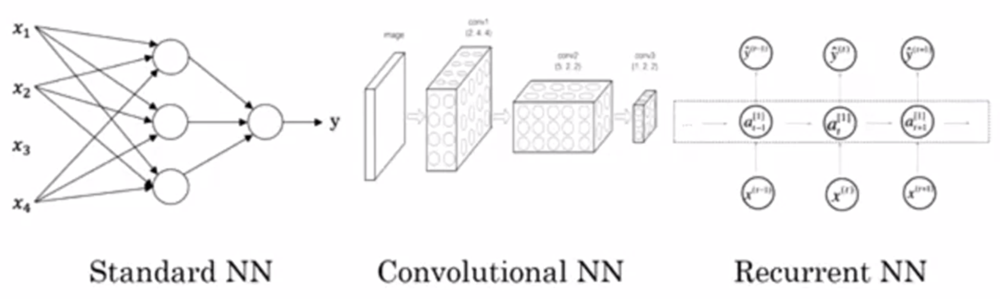
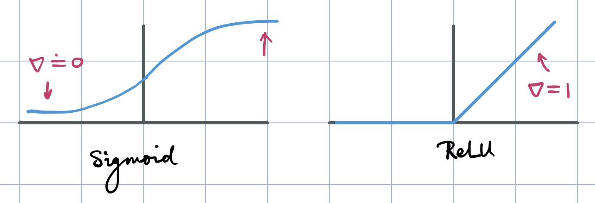

Deep Learning Specialization, Course A
**Neural Networks and Deep Learning** by deeplearning.ai, ***Andrew Ng,*** [Coursera]( https://www.coursera.org/learn/neural-networks-deep-learning/home/info)

***Week 1:*** *Introduction to Deep Learning*

1. Understand the major trends driving the rise of deep learning.
2. Be able to explain how deep learning is applied to supervised learning.
3. Understand what are the major categories of models (such as CNNs and RNNs), and when they should be applied.
4. Be able to recognize the basics of when deep learning will (or will not) work well.

<!-- more -->

### Introduction to Deep Learning

#### What is a neural network?

**ReLU,** Rectified Linear Unit Function: $\max\left(0,y\right)$

**Notice** that each of these hidden units in the neural network takes its inputs all four input features. ***(density connected)***

#### Supervised Learning with Neural Networks

- **standard neural network**
- **convolution on neural networks, CNN:** image applications
- **recurrent neural network, RNN:** sequence data
- **custom / hybrid**

- **Structured Data:** features have well defined meanings
- **Unstructured Data:** audio / image / text

#### Why is Deep Learning taking off?

- **Data**
  ***m:*** size of training sets / number of training examples &emsp; *(on small training sets: feature engineering)*
  
  
- **Computation**

- **Algorithms**
  ***activation function:*** Sigmoid → ReLU
  

