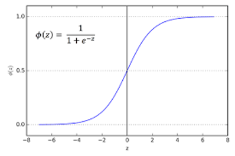
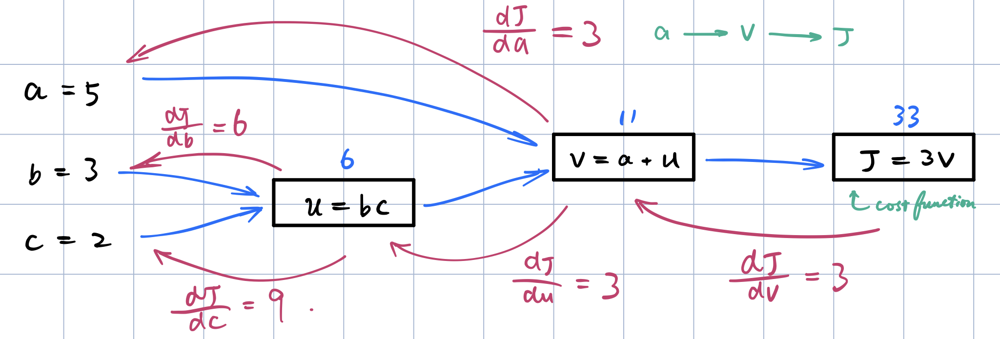

Deep Learning Specialization, Course A
**Neural Networks and Deep Learning** by deeplearning.ai, ***Andrew Ng,*** [Coursera]( https://www.coursera.org/learn/neural-networks-deep-learning/home/info)

***Week 2:*** *Neural Networks Basics*

1. Build a logistic regression model, structured as a shallow neural network
2. Implement the main steps of an ML algorithm, including making predictions, derivative computation, and gradient descent.
3. Implement computationally efficient, highly vectorized, versions of models.
4. Understand how to compute derivatives for logistic regression, using a backpropagation mindset.
5. Become familiar with Python and Numpy
6. Work with iPython Notebooks
7. Be able to implement vectorization across multiple training examples

<!-- more -->

### Logistic Regression as a Neural Network

#### Binary Classification

- ***y:*** 1<sup>*(cat)*</sup> vs 0<sup>*(non cat)*</sup>
- ***image size:*** 64 × 64
- ***n<sub>x</sub>:*** 12288
- ***m:*** $\left\{ \left(x^{\left(1\right)},\ y^{\left(1\right)}\right),\  \left(x^{\left(2\right)},\ y^{\left(2\right)}\right),\ \dots ,\  \left(x^{\left(m\right)},\ y^{\left(m\right)}\right) \right\} \qquad x^{\left(i\right)}\in\mathbb{R}^{n_x},\ y^{\left(i\right)} \in\left\{0,1\right\}$


$x = \underbrace{\left[ \begin{matrix} 255 & 231 & 42 & \cdots & 255 & 134 & 202 & \cdots & 231 & 134 & 93 & \cdots \end{matrix} \right]^{\mathsf{T}}}_{n_x\ =\ 64\times64\times3\ =\ 12288}$

$X = \left[ \begin{matrix} \Big| & \Big| & \Big| & & \Big| \\ x^{\left(1\right)} & x^{\left(2\right)} & x^{\left(3\right)} & \cdots & x^{\left(m\right)} \\ \Big| & \Big| & \Big| & & \Big| \end{matrix} \right]  \qquad X\in\mathbb{R}^{n_x \times m}$

$Y = \left[ \begin{matrix} y^{\left(1\right)} & y^{\left(2\right)} & y^{\left(3\right)} & \cdots & y^{\left(m\right)} \end{matrix} \right]  \qquad Y\in\mathbb{R}^{1 \times m}$

#### Logistic Regression

Given $x\in\mathbb{R}^{n_x}$, want $\hat{y} = P\left(y=1\ |\ x\right)$.
***Parameters:*** $w\in\mathbb{R}^{n_x},\ b\in\mathbb{R}^{n_x}$
***Output:*** $\hat{y}= \sigma\left( w^{\mathsf{T}}x+b \right) \qquad 0\leq\hat{y}\leq1$
&emsp;&emsp;&emsp;&emsp;$\sigma\left( z \right)={\rm sigmoid}\left(z\right) = \dfrac{1} {1 + e^{-z}}$



#### Logistic Regression Cost Function

Given $\left\{ \left(x^{\left(1\right)},\ y^{\left(1\right)}\right),\  \left(x^{\left(2\right)},\ y^{\left(2\right)}\right),\ \dots ,\  \left(x^{\left(m\right)},\ y^{\left(m\right)}\right) \right\}$, want $\hat{y}^{\left(i\right)}=y^{\left(i\right)}$.

***Loss (error) function:*** $L\left(\hat{y},\,y\right)=-\left( y\log\hat{y} +\left(1-y\right) \log\left(1-\hat{y}\right) \right)$
&emsp;&emsp;&emsp;&emsp;*Notice:* $L\left(\hat{y},\,y\right) = \dfrac{1}{2}\left(\hat{y}-y\right)^2$ makes optimization problem **non-convex.**

***Cost function:*** $\begin{aligned}J\left(w,\,b\right)= \dfrac{1}{m} \sum_{i=1}^{m} L\left(\hat{y}^{\left(i\right)},\,y^{\left(i\right)}\right)= -\dfrac{1}{m} \sum_{i=1}^{m} \left( y^{\left(i\right)}\log\hat{y}^{\left(i\right)} +\left(1-y^{\left(i\right)}\right) \log\left(1-\hat{y}^{\left(i\right)}\right) \right)\end{aligned}$

Want to find $w, b$ to minimize $J\left(w,\,b\right)$.

#### Gradient Descent

1. initialize **w, b**​ to **0​**

2. iterate until **converge** to global optimum &emsp; ( ***J(w, b)*** *is convex )*

   $w:=w-\alpha \cdot \dfrac {\partial J\left( w,b\right)}{\partial w} \qquad b:=b-\alpha \cdot \dfrac {\partial J\left( w,b\right)}{\partial b}$

#### Derivatives with a Computation Graph

$J\left(a,b,c\right) = \underbrace{3\,(\underbrace{a + \underbrace{bc}_{u\,=\,bc}}_{v\,=\,a+u})}_{J\,=\,3v}$

- ***forward propagation*** → cost function
  

- ***back propagation*** → derivatives

  Chain Rule: $\dfrac{dJ}{da} = \dfrac{dJ}{dv}\dfrac{dv}{da} = 3$, $\dfrac{dJ}{db} = \dfrac{dJ}{dv}\dfrac{dv}{du}\dfrac{du}{db} = 6$, $\dfrac{dJ}{dc} = \dfrac{dJ}{dv}\dfrac{dv}{du}\dfrac{du}{dc} = 9$

  &emsp;&emsp;&emsp;&emsp;*p.s.* $\dfrac{d{\rm FinalOutputVar}}{d{\rm var}}$ in code is simplified as `dvar`, e.g., `dv = 3`, `da = 3`.
  

#### Logistic Regression Gradient Descent

$w_1 :=w_1 -\alpha \cdot dw_1 \qquad w_2 :=w_2 -\alpha \cdot dw_2 \qquad b:=b-\alpha \cdot db$


#### Gradient Descent on m Examples

$J\left(w,\,b\right)= \dfrac{1}{m} \sum_{i=1}^{m} L\left(a^{\left(i\right)},\,y^{\left(i\right)}\right)$

$\dfrac{\partial}{\partial w_1} J\left(w,\,b\right)= \dfrac{1}{m} \sum_{i=1}^{m}  \underbrace{\dfrac{\partial}{\partial w_1} L\left(a^{\left(i\right)},\,y^{\left(i\right)}\right)}_{dw_1^{\left(i\right)}}$

##### Algorithm *(one step of gradient descent)*

$J=0; \ dw_1=0; \ dw_2=0; \ db=0$

For $i=1$ to $m$
&emsp;&emsp;$z^{\left(i\right)} = w^{\mathsf{T}} x^{\left(i\right)} +b$
&emsp;&emsp;$a^{\left(i\right)} = \sigma \left( x^{\left(i\right)} \right)$
&emsp;&emsp;$J +\!\!= - \left[ y^{\left(i\right)}\log a^{\left(i\right)} +\left(1-y^{\left(i\right)}\right) \log\left(1- a^{\left(i\right)}\right) \right]$
&emsp;&emsp;$dz^{\left(i\right)} = a^{\left(i\right)} - y^{\left(i\right)}$
&emsp;&emsp;$dw_1 +\!\!= x_1^{\left(i\right)} dz^{\left(i\right)}$
&emsp;&emsp;$dw_2 +\!\!= x_2^{\left(i\right)} dz^{\left(i\right)}$&emsp;&emsp;&emsp;&emsp;*( n = 2 )*
&emsp;&emsp;$db +\!\!= dz^{\left(i\right)}$

$J /\!\!= m; \ w_1/\!\!= m; \ dw_2/\!\!= m; \ db/\!\!= m$

$w_1 :=w_1 -\alpha \cdot dw_1 \\ w_2 :=w_2 -\alpha \cdot dw_2 \\ b:=b-\alpha \cdot db$

**Weakness**

- ***Efficiency:*** two for loops (m training samples, all features) → ***vectorization***

### Python and Vectorization

#### Vectorization

$z = w^{\mathsf{T}}x+b$

$w = \left[ \begin{matrix} \vdots \\ \vdots \end{matrix} \right] \qquad x = \left[ \begin{matrix} \vdots \\ \vdots \end{matrix} \right]  \qquad w\in\mathbb{R}^{n_x}, \  x\in\mathbb{R}^{n_x}$

**non-vectorized**

```python
z = 0
for i in range(n_x):
    z += w[i] * x[i]
z += b
```

**vectorized**

```python
z = np.dot(w, x) + b
```

*avoid using explicit for loops whenever possible*

##### Algorithm *(one for-loop)*

$J=0; \ dw=np.zeros\left(n_x, 1\right); \ db=0$

For $i=1$ to $m$
&emsp;&emsp;$z^{\left(i\right)} = w^{\mathsf{T}} x^{\left(i\right)} +b$
&emsp;&emsp;$a^{\left(i\right)} = \sigma \left( x^{\left(i\right)} \right)$
&emsp;&emsp;$J +\!\!= - \left[ y^{\left(i\right)}\log a^{\left(i\right)} +\left(1-y^{\left(i\right)}\right) \log\left(1- a^{\left(i\right)}\right) \right]$
&emsp;&emsp;$dz^{\left(i\right)} = a^{\left(i\right)} - y^{\left(i\right)}$
&emsp;&emsp;$dw +\!\!= x^{\left(i\right)} dz^{\left(i\right)}$
&emsp;&emsp;$db +\!\!= dz^{\left(i\right)}$

$J /\!\!= m; \ db/\!\!= m$

$w :=w -\alpha \cdot dw \\ b:=b-\alpha \cdot db$

#### Vectorizing Logistic Regression

$z^{\left(i\right)} = w^{\mathsf{T}} x^{\left(i\right)} +b \qquad a^{\left(i\right)} = \sigma \left( x^{\left(i\right)} \right)$

$\begin{aligned}X= \left[ \begin{matrix} \Big| & \Big| & \Big| & & \Big| \\ x^{\left(1\right)} & x^{\left(2\right)} & x^{\left(3\right)} & \cdots & x^{\left(m\right)} \\ \Big| & \Big| & \Big| & & \Big| \end{matrix} \right] \qquad X\in\mathbb{R}^{n_x \times m}\end{aligned}$

$\begin{aligned}Y = \left[ \begin{matrix} y^{\left(1\right)} & y^{\left(2\right)} & y^{\left(3\right)} & \cdots & y^{\left(m\right)} \end{matrix} \right]  \qquad Y\in\mathbb{R}^{1 \times m}\end{aligned}$

$\begin{aligned}Z=\left[ \begin{matrix} z^{\left(1\right)} & z^{\left(2\right)} & z^{\left(3\right)} & \cdots & z^{\left(m\right)} \end{matrix} \right] &=w^{\mathsf{T}}X+ \left[ \begin{matrix} b & b & b & \cdots & b \end{matrix} \right] \\ &= \underbrace{\left[ \begin{matrix} w^{\mathsf{T}} x^{\left(1\right)} +b & w^{\mathsf{T}} x^{\left(2\right)} +b & w^{\mathsf{T}} x^{\left(3\right)} +b & \cdots & w^{\mathsf{T}} x^{\left(m\right)} +b \end{matrix} \right]}_{1 \times m} \end{aligned}$
$\begin{aligned}A= \left[ \begin{matrix} a^{\left(1\right)} & a^{\left(2\right)} & a^{\left(3\right)} & \cdots & a^{\left(m\right)} \end{matrix} \right]  = \sigma \left( Z \right)\end{aligned}$

```python
Z = np.dot(w.T, X) + b      # broadcasting
```

#### Vectorizing Logistic Regression's Gradient Output

$ dz^{\left(i\right)} = a^{\left(i\right)} - y^{\left(i\right)}$

$\begin{aligned}dZ=\left[ \begin{matrix} dz^{\left(1\right)} & dz^{\left(2\right)} & dz^{\left(3\right)} & \cdots & dz^{\left(m\right)} \end{matrix} \right] \end{aligned}$

$\begin{aligned}dZ=Z-Y&=\left[ \begin{matrix} a^{\left(1\right)}-y^{\left(1\right)} & a^{\left(2\right)}-y^{\left(2\right)} & a^{\left(3\right)}-y^{\left(3\right)} & \cdots & a^{\left(m\right)}-y^{\left(m\right)} \end{matrix} \right] \end{aligned}$

$\begin{aligned}db=\dfrac{1}{m} \sum ^{m}_{i=1} dz^{\left(i\right)} \end{aligned}$

$\begin{aligned}dw &=\dfrac{1}{m}\ X\ dZ^{\mathsf{T}}  \\ &= \dfrac{1}{m} \left[ \begin{matrix} \Big| & \Big| & \Big| & & \Big| \\ x^{\left(1\right)} & x^{\left(2\right)} & x^{\left(3\right)} & \cdots & x^{\left(m\right)} \\ \Big| & \Big| & \Big| & & \Big| \end{matrix} \right] \left[ \begin{matrix} dz^{\left(1\right)} \\ dz^{\left(2\right)} \\ \vdots \\ dz^{\left(m\right)} \end{matrix} \right] \\&= \dfrac{1}{m}\underbrace{ \left[ \begin{matrix} x^{\left(1\right)}dz^{\left(1\right)} + x^{\left(2\right)}dz^{\left(2\right)} + x^{\left(3\right)}dz^{\left(3\right)} + \dots + x^{\left(m\right)}dz^{\left(m\right)} \end{matrix} \right] }_{n\times1} \end{aligned}$

```python
dZ = A - Y
db = np.sum(dZ) / m
dw = np.dot(X, dZ.T) / m
```

##### Algorithm *(vectorized)*

$\begin{aligned} & Z = w^{\mathsf{T}}X + b \\& A = \sigma\left(Z\right) \\& dZ = A -Y\end{aligned}$

$\begin{aligned}&dw =\dfrac{1}{m}\ X\ dZ^{\mathsf{T}} \\& db=\dfrac{1}{m} \sum ^{m}_{i=1} dz^{\left(i\right)}\end{aligned}$

$\begin{aligned}&w := w -\alpha \cdot dw \\& b :=b-\alpha \cdot db\end{aligned}$

*still need a for loop to have iterations of gradient descent*

#### Explanation of Logistic Regression Cost Function

***maximize:*** $\begin{aligned}\hat{y} = P\left(y=1\ |\ x\right)\end{aligned}$

&emsp;&emsp;$\begin{aligned}\hat{y}= \sigma\left( w^{\mathsf{T}}x+b \right) \qquad \sigma\left( z \right)={\rm sigmoid}\left(z\right) = \dfrac{1} {1 + e^{-z}}\end{aligned}$

&emsp;&emsp;$\begin{aligned}\begin{cases} p\left(y|x\right) = \hat{y} \quad &{\rm if} \ \  y=1 \\ p\left(y|x\right) = 1- \hat{y} \quad &{\rm if} \ \  y=0 \end{cases} \quad \Longrightarrow \quad p\left(y|x\right) = \hat{y}^y \left(1-\hat{y}\right)^{1-y} \end{aligned}$

&emsp;&emsp;$\begin{aligned}\log p\left(y|x\right) = \log\left( \hat{y}^y \left(1-\hat{y}\right)^{1-y}\right) =y\log\hat{y} +\left(1-y\right) \log\left(1-\hat{y}\right) \end{aligned}$

***minimize:*** $\begin{aligned}L\left(\hat{y},\,y\right)=-\left( y\log\hat{y} +\left(1-y\right) \log\left(1-\hat{y}\right) \right)\end{aligned}$

&emsp;&emsp;$\begin{aligned} p\left({\rm labels\ in\ training\ set}\right) = \prod_{i=1}^{m} p\left(y^{\left(i\right)}|x^{\left(i\right)}\right)\end{aligned}$

&emsp;&emsp;$\begin{aligned} \log p\left({\rm labels\ in\ training\ set}\right) &= \log \left( \prod_{i=1}^{m} p\left(y^{\left(i\right)}|x^{\left(i\right)}\right) \right) \\ &= \sum_{i=1}^{m} \log\left(p\left(y^{\left(i\right)}|x^{\left(i\right)}\right)\right) \\ &= -\sum_{i=1}^{m}L\left(\hat{y}^{\left(i\right)},\,y^{\left(i\right)}\right) \end{aligned}$

***minimize:*** $\begin{aligned} J\left(w,\,b\right)= \dfrac{1}{m} \sum_{i=1}^{m} L\left(\hat{y}^{\left(i\right)},\,y^{\left(i\right)}\right)\end{aligned}$

### Programming Assignments

#### Python Basics with numpy

#### Logistic Regression with a Neural Network mindset

<a href='https://github.com/bugstop/coursera-deep-learning-solutions' target="_blank">Solutions Manual</a>

