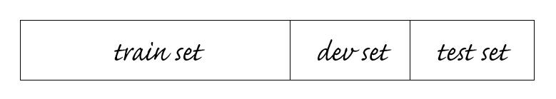
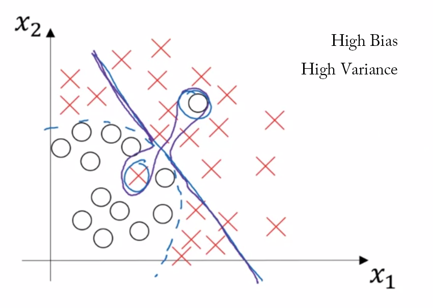
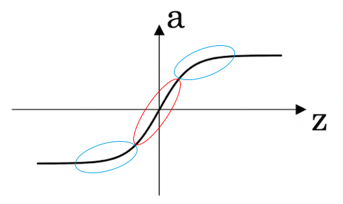
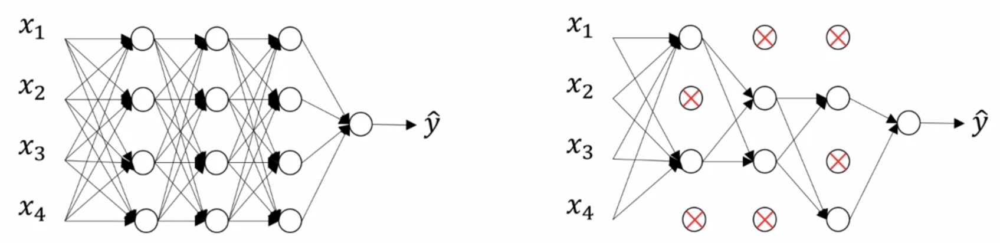
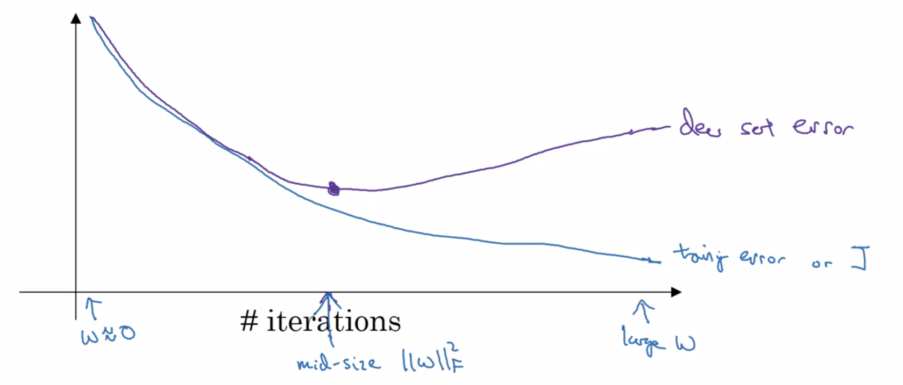
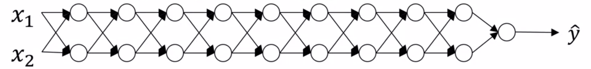
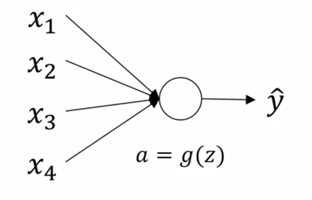

Deep Learning Specialization, Course B
**Improving Deep Neural Networks: Hyperparameter tuning, Regularization and Optimization**
by deeplearning.ai, ***Andrew Ng,*** [Coursera]( https://www.coursera.org/learn/neural-networks-deep-learning/home/info)

***Week 1:*** *Practical Aspects of Deep Learning*

1. Recall that different types of initializations lead to different results
2. Recognize the importance of initialization in complex neural networks.
3. Recognize the difference between train/dev/test sets
4. Diagnose the bias and variance issues in your model
5. Learn when and how to use regularization methods such as dropout or L2 regularization.
6. Understand experimental issues in deep learning such as Vanishing or Exploding gradients and learn how to deal with them
7. Use gradient checking to verify the correctness of your backpropagation implementation

<!-- more -->

### Setting Up your Machine Learning Application

#### Train / Dev / Test Sets

learning rate, \# iterations, \# hidden units, activation function, ...



**Size**

- Previous era: 70%-30% or 60%-20%-20%
- Big data era: 98%-1%-1%, smaller dev and test sets

**Mismatched Distribution**

- make sure dev and test sets come from same distribution
- not having a test set might be okay (only dev set)

#### Bias / Variance




#### Basic Recipe for Machine Learning

1. **High bias?** (training set performance)

   → bigger network, longer time, (architecture), ...

2. **High variance?** (dev set performance)

   → more data, regularization, (architecture), ...

#### Regularizing your Neural Network

#### Regularization

##### Logistic Regression

$\min_{w,b}J\left(w,b\right) \qquad w \in \mathbb{R}^{n_x}, \ b \in \mathbb{R}$

$\begin{aligned} J\left(w,b\right) = \dfrac{1}{m} \sum_{i=1}^{m} L\left( \hat{y} ^\left(i\right),\, y^\left(i\right) \right) &+ \dfrac{\lambda}{2m} \left|\left| w \right| \right| ^2 \quad \color{lightgray} { \overbrace{ + \dfrac{\lambda}{2m} b^2} ^{\rm omit} }\\ L_2 \textsf{ Regulariztion} \qquad \left|\left| w \right| \right| ^2 &= \sum_{j=1}^{n_x} w_j^2 = w^{\mathsf{T}} w \end{aligned}$

- ***λ:*** regularization parameter

##### Neural Network

$\begin{aligned} J\left( W^{\left[1\right]},b^{\left[1\right]}, \dots,W^{\left[L\right]},b^{\left[L\right]}\right) = \dfrac{1}{m} \sum_{i=1}^{m} L & \left( \hat{y} ^\left(i\right),\, y^\left(i\right) \right) + \dfrac{\lambda}{2m} \sum_{l=1}^{L} \left|\left| W^{\left[l\right]} \right| \right| ^2_F \\ \textsf{ Frobenius norm} \qquad \left|\left| W ^{\left[ l \right]} \right| \right| ^2_F &= \sum_{i=1}^{n ^{\left[ l \right]}} \sum_{j=1}^{n ^{\left[ l-1 \right]}} \left( {w_{ij} ^{\left[ l \right]}} \right) ^2 \qquad W \in \mathbb{R}^{n^{\left[ L \right]} \times n^{\left[ L-1 \right]}} \end{aligned}$

**Weight Decay**

$\begin{aligned} dW^\left[l\right] &= \overbrace{\dfrac{1}{m} \, dZ^\left[l\right] { A^\left[l-1\right] }^{\mathsf{T}}} ^{\textsf{backpropagation}} + \dfrac{\lambda}{m} W^\left[l\right] \\ W^\left[l\right] &= W^\left[l\right] - \alpha\ dW^\left[l\right] = \underbrace{ \left(1 - \dfrac{\alpha \, \lambda}{m} \right) W^\left[l\right]} _{\textsf{weight decay}} - \alpha \left( {\dfrac{1}{m} \, dZ^\left[l\right] { A^\left[l-1\right] }^{\mathsf{T}}} \right) \end{aligned}$

#### Why Regularization Reduces Overfitting?

- variance reduction
  
- g(z) *(every layer)* is roughly linear
  

#### Dropout Regularization



**Inverted Dropout**

```python
# layer 3
keep_prob = 0.8
d3 = np.random.rand(a3.shape[0], a3.shape[1]) < keep_prob
a3 = a3 * d3
a3 /= keep_prob  # expected value of a3 remains the same
```

***Notice:*** do not use dropout at test time

#### Understanding Dropout

***Intuition:*** can't rely on any *one* feature, so have to spread out weights
**shrink the squared norm of the weights**

#### Other Regularization Methods

- data augmentation
- early stopping
  
  **Orthorganization**
  - Optimize cost function $J$
  - Not overfit

### Setting Up Your Optimization Problem

#### Normalizing Inputs

1. subtract mean
   $x:=x-\mu \qquad \mu= \frac{1}{m} \sum_{i=1}^{m} x^{\left( i \right)}$
2. normalize variance
   $x:= x / \sigma \qquad \sigma ^2 = \frac{1}{m} \sum_{i=1}^{m} { x^{\left( i \right)} } ^2$
3. use same μ, σ<sup>2</sup> to normalize test set
   $x := \dfrac{x- \mu}{\sigma}$


#### Vanishing / Exploding Gradients



$W^{\left[1\right]},\ W^{\left[2\right]},\ W^{\left[3\right]},\ \dots, \ W^{\left[L\right]} \qquad {\rm set} \ \ g\left(z\right)=z, \ b^{\left[l\right]} =0$

$\Rightarrow y= W^{\left[L\right]}W^{\left[L-1\right]}W^{\left[L-2\right]}\cdots W^{\left[2\right]}W^{\left[1\right]}x$

$\begin{aligned} {\rm assume} \ \ W^{\left[l\right]}= \left[ \begin{matrix} 1.5&0\\0&1.5 \end{matrix} \right], \qquad \ \ &y= W^{\left[L\right]} \left[ \begin{matrix} 1.5&0\\0&1.5 \end{matrix} \right] ^{L-1} x \quad \sim 1.5^L \\ {\rm assume} \ \ W^{\left[l\right]}= \left[ \begin{matrix} 0.5&0\\0&0.5 \end{matrix} \right], \qquad \ \ &y= W^{\left[L\right]} \left[ \begin{matrix} 0.5&0\\0&0.5 \end{matrix} \right] ^{L-1} x \quad \sim 0.5^L \end{aligned}$

**activations** and **gradients** increasing or decreasing ***exponentially*** as a function of **L**

#### Weight Initialization for Deep Networks

##### Single Neuron



$z= w_1x_1 + w_2x_2 + \dots + w_nx_n \ \ \color{lightgray} {+ b}$

larger n → smaller w<sub>i</sub> $\Rightarrow {\rm Var}\left( w_i \right) = \frac{1}{n} $

$\begin{aligned} {\rm ReLU:} \qquad & W^{\left[l\right]}= \texttt{np.random.randn(shape) \* np.sqrt(} \dfrac{2}{n^{\left[l-1\right]}} \texttt{)} \\ {\rm tanh:} \qquad & W^{\left[l\right]}= \texttt{np.random.randn(shape) \* np.sqrt(} \dfrac{1}{n^{\left[l-1\right]}} \texttt{)} \\ & W^{\left[l\right]}= \texttt{np.random.randn(shape) \* np.sqrt(} \dfrac{2}{n^{\left[l-1\right]} + n^{\left[l\right]}} \texttt{)}  \end{aligned}$

#### Numerical Approximation of Gradients

$\begin{aligned} & f'\left(\theta\right) = \lim_{\epsilon\rightarrow 0} \dfrac{f\left(\theta+\epsilon\right)-f\left(\theta-\epsilon\right)}{2\epsilon} \quad\Rightarrow\quad & \dfrac{f\left(\theta+\epsilon\right)-f\left(\theta-\epsilon\right)}{2\epsilon}\approx g\left(\theta\right) \quad & {\sim O\left(\epsilon^2\right)} \\ & & \color{lightgray} {\dfrac{f\left(\theta+\epsilon\right)-f\left(\theta\right)}{\epsilon}\approx g\left(\theta\right) }\quad & \color{lightgray} {\sim O\left(\epsilon\right)} \end{aligned}$

#### Gradient Checking

1. take $W^{\left[1\right]},b^{\left[1\right]}, \dots,W^{\left[L\right]},b^{\left[L\right]}$ and reshape into a big vector $\Theta$

   $J\left(W^{\left[1\right]},b^{\left[1\right]}, \dots,W^{\left[L\right]},b^{\left[L\right]}\right)=J\left(\Theta\right)$

2. take $dW^{\left[1\right]},db^{\left[1\right]}, \dots,dW^{\left[L\right]},db^{\left[L\right]}$ and reshape into a big vector $d\Theta$

3. ***grad check:*** is $d\Theta$ the gradient of the cos function $J\left(\Theta\right)=J\left(\theta_1,\theta_2,\dots\right)$

   $\begin{aligned}\texttt{for each i:} & \\ \qquad d\theta_{approx}^{\left[i\right]} &= \dfrac{J\left(\theta_1,\theta_i+\epsilon,\dots,\theta_2,\dots\right)-J\left(\theta_1,\theta_i-\epsilon,\dots,\theta_2,\dots\right)}{2\epsilon} \\ &\approx d\theta^{\left[i\right]}=\dfrac{\partial J}{\partial \theta_i} \qquad\qquad\qquad\qquad \epsilon\sim 10^{-7} \end{aligned}$

   **check Euclidean distance**

   $\dfrac{\left|\left| d\theta_{approx}-d\theta \right| \right| _2}{\left|\left| d\theta_{approx} \right| \right| _2 + \left|\left| d\theta \right| \right| _2} \sim\epsilon$

#### Gradient Checking Implementation Notes

- do not use in training, only to debug
- if algorithm fails grad check, look at components to identify bug
- remember regularization
- does not work with dropout
- run at random initialization; again after some training

### Programming Assignment

#### Initialization


#### Regularization


#### Gradient Checking


<a href='https://github.com/bugstop/coursera-deep-learning-solutions' target="_blank">Solutions Manual</a>