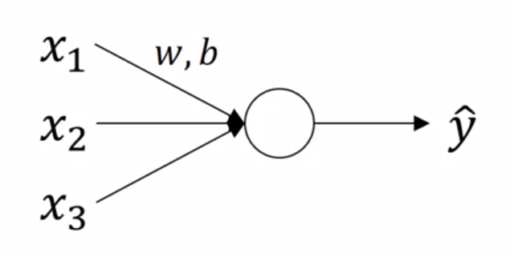

Deep Learning Specialization, Course B
**Improving Deep Neural Networks: Hyperparameter tuning, Regularization and Optimization**
by deeplearning.ai, ***Andrew Ng,*** [Coursera]( https://www.coursera.org/learn/neural-networks-deep-learning/home/info)

***Week 3:*** *Hyperparameter Tuning, Batch Normalization and Programming Frameworks*

1. Master the process of hyperparameter tuning

<!-- more -->

### Hyperparameter Tuning

#### Tuning Process

- **hyperparameter**
- ***α***
  - **β** ~ 0.9
  - β<sub>1</sub>, β<sub>2</sub>, ε = 0.9, 0.999, 10<sup>-8</sup>
  - *\# layers*
  - **\# hidden units**
  - *learning rate decay*
  - **mini-batch size**

try **random values,** don't use a *grid;*  
**coarse to fine** search

#### Using an Appropriate Scale to Pick Hyperparameters

α ~ 10<sup>a</sup> ~ 10<sup>b</sup>

```python
r = np.random.uniform(a, b)
alpha = 10 ** r
```

β ~ 0.9 ~ 0.999... → 1-10<sup>b</sup> ~ 1-10<sup>a</sup>

```python
r = np.random.uniform(a, b)
beta = 1 - 10 ** r
```

#### Hyperparameters Tuning in Practice: Pandas vs. Caviar

- ***Pandas:*** babysitting one model
- ***Caviar:*** training many models in parallel

### Batch Normalization

#### Normalizing Activations in a Network



$\qquad \begin{aligned}\mu &= \frac{1}{m} \sum_{i=1}^{m} x^{\left( i \right)} \\\sigma ^2 &= \frac{1}{m} \sum_{i=1}^{m} { x^{\left( i \right)} } ^2 \\ x &= \dfrac{x- \mu}{\sigma} \end{aligned}$


**normalize z<sup>[l]</sup>**

Given some intermediate values $z^{\left[l\right]\left(i\right)} = z^{\left( 1 \right)},\,z^{\left( 2 \right)},\,\dots,\,z^{\left( m \right)}$

$\qquad \begin{aligned}\mu &= \frac{1}{m} \sum_{i=1}^{m} z^{\left( i \right)} \\ \sigma ^2 &= \frac{1}{m} \sum_{i=1}^{m} {\left( z^{\left( i \right)} -\mu \right)} ^2 \\ z^{\left( i \right)}_{\rm norm} &= \dfrac{z^{\left( i \right)}- \mu}{\sqrt{ \sigma^2 + \varepsilon }} \\ \tilde{z}^{\left( i \right)} &= \gamma z^{\left( i \right)}_{\rm norm} + \beta \end{aligned}$

&emsp;&emsp;&emsp;&emsp;&emsp;*γ, β are learnable parameters of your model*

use $\tilde{z}^{\left[l\right]\left(i\right)}$ instead of $z^{\left[l\right]\left(i\right)}$

#### Fitting Batch Norm into a Neural Network

$x \xrightarrow{ W^{\left[1\right]},\,b^{\left[1\right]} } z^{\left[1\right]} \xrightarrow[\small {}^\textsf{Batch Norm}]{ \gamma^{\left[1\right]},\,\beta^{\left[1\right]} } \tilde{z}^{\left[1\right]} \xrightarrow[\small {}^{g^{\left[1\right]}}]{} a^{\left[1\right]}  \xrightarrow{ W^{\left[2\right]},\,b^{\left[2\right]} } z^{\left[2\right]} \xrightarrow[\small {}^\textsf{Batch Norm}]{ \gamma^{\left[2\right]},\,\beta^{\left[2\right]} } \tilde{z}^{\left[2\right]} \xrightarrow[\small {}^{g^{\left[2\right]}}]{} a^{\left[2\right]} \xrightarrow{} \cdots$

**Parameters:** $\begin{aligned} & W^{\left[1\right]},\,b^{\left[1\right]} ,\, W^{\left[2\right]},\,b^{\left[2\right]} ,\, \dots,\, W^{\left[l\right]},\,b^{\left[l\right]} \\  & \gamma^{\left[1\right]},\,\beta^{\left[1\right]} ,\, \gamma^{\left[2\right]},\,\beta^{\left[2\right]} ,\, \dots,\, \gamma^{\left[l\right]},\,\beta^{\left[l\right]} \end{aligned}$

##### working with mini-batches

$\begin{aligned} & X^{\left\{1\right\}} \xrightarrow{ W^{\left[1\right]},\,b^{\left[1\right]} } Z^{\left[1\right]} \xrightarrow[\small {}^\textsf{Batch Norm}]{ \gamma^{\left[1\right]},\,\beta^{\left[1\right]} } \tilde{Z}^{\left[1\right]} \xrightarrow[\small {}^{g^{\left[1\right]}}]{} A^{\left[1\right]}  \xrightarrow{ W^{\left[2\right]},\,b^{\left[2\right]} } Z^{\left[2\right]} \xrightarrow[\small {}^\textsf{Batch Norm}]{ \gamma^{\left[2\right]},\,\beta^{\left[2\right]} } \tilde{Z}^{\left[2\right]} \xrightarrow[\small {}^{g^{\left[2\right]}}]{} A^{\left[2\right]} \xrightarrow{} \cdots \\ & X^{\left\{2\right\}} \xrightarrow{ W^{\left[1\right]},\,b^{\left[1\right]} } Z^{\left[1\right]} \xrightarrow[\small {}^\textsf{Batch Norm}]{ \gamma^{\left[1\right]},\,\beta^{\left[1\right]} } \tilde{Z}^{\left[1\right]} \xrightarrow[\small {}^{g^{\left[1\right]}}]{} A^{\left[1\right]}  \xrightarrow{ W^{\left[2\right]},\,b^{\left[2\right]} } Z^{\left[2\right]} \xrightarrow[\small {}^\textsf{Batch Norm}]{ \gamma^{\left[2\right]},\,\beta^{\left[2\right]} } \tilde{Z}^{\left[2\right]} \xrightarrow[\small {}^{g^{\left[2\right]}}]{} A^{\left[2\right]} \xrightarrow{} \cdots \\ & \cdots \end{aligned}$

&emsp;&emsp;***Notice:*** b<sup>[l]</sup> can be eliminated (or always be zero) since it is subtracted out during batch normalization

&emsp;&emsp;$\begin{aligned} & z^{\left[l\right]} = W^{\left[l\right]}a^{\left[l-1\right]} \\ & \tilde{z}^{\left[l\right]} = \gamma^{\left[l\right]} z^{\left( l \right)}_{\rm norm} +\beta^{\left[l\right]} \end{aligned}$

**Parameters:** $W^{\left[1\right]} \in \mathbb{R}^{n^{\left[ l \right]} \times n^{\left[ l-1 \right]}} ,\quad \gamma^{\left[l\right]} \in \mathbb{R}^{n^{\left[ l \right]} \times 1} ,\quad \beta^{\left[l\right]} \in \mathbb{R}^{n^{\left[ l \right]} \times 1}$

for t = 1, 2, ..., num_mini_batches

&emsp;&emsp;forward prop on X<sup>{t}</sup>

&emsp;&emsp;&emsp;&emsp;in each hidden layer, use BN to replace z<sup>[l]</sup> with z̃<sup>[l]</sup>

&emsp;&emsp;back prop  to compute dW<sup>[l]</sup>, dγ<sup>[l]</sup>, dβ<sup>[l]</sup>

&emsp;&emsp;update parameters

&emsp;&emsp;$\qquad \begin{aligned} & W^{\left[l\right]} := W^{\left[l\right]} - dW^{\left[l\right]} \\ & \gamma^{\left[l\right]} := \gamma^{\left[l\right]} - d\gamma^{\left[l\right]} \\ & \beta^{\left[l\right]} := \beta^{\left[l\right]} - d\beta^{\left[l\right]} \end{aligned}$

&emsp;&emsp;&emsp;&emsp;&emsp;&emsp;*works with Momentum / RMSProp / Adam*

#### Why does Batch Norm Work?

**covariate shift**

batch norm limits the amount to which updating the parameters in the earlier layers can affect the distribution of values that the layer now sees and therefore has to learn on

**regularization**

similar to dropout, batch norm adds some noise to each hidden layer's activations which has a *slight* effect

#### Batch Norm at Test Time

**on mini-batches:**

$\qquad \begin{aligned}\mu^{\left[l\right]} &= \frac{1}{m} \sum_{i=1}^{m} z^{\left[l\right]\left(i\right)} \\ {\sigma ^2} ^{\left[l\right]} &= \frac{1}{m} \sum_{i=1}^{m} {\left( z^{\left[l\right]\left(i\right)} -\mu ^{\left[l\right]} \right)} ^2 \\ z^{\left[l\right]\left(i\right)}_{\rm norm} &= \dfrac{z^{\left[l\right]\left(i\right)}- \mu ^{\left[l\right]}}{\sqrt{ {\sigma ^2} ^{\left[l\right]} + \varepsilon }} \\ \tilde{z}^{\left[l\right]\left(i\right)} &= \gamma^{\left[l\right]}  z^{\left[l\right]\left(i\right)}_{\rm norm} + \beta ^{\left[l\right]} \end{aligned}$

**at test time:**

μ, σ<sup>2</sup> is estimated using a exponentially weighted average (across the mini-batches)

$\qquad \begin{aligned}\mu ^{\left[l\right]} &= \frac{1}{T} \sum_{t=1}^{T} \mu^{\left\{t\right\} \left[l\right]} \\ {\sigma ^2} ^{\left[l\right]} &= \frac{1}{T} \sum_{t=1}^{T} {\sigma ^2}^{\left\{t\right\} \left[l\right]} \\ z^{\left[l\right]\left(i\right)}_{\rm norm} &= \dfrac{z^{\left[l\right]\left(i\right)}- \mu ^{\left[l\right]}}{\sqrt{ {\sigma ^2} ^{\left[l\right]} + \varepsilon }} \\ \tilde{z}^{\left[l\right]\left(i\right)} &= \gamma^{\left[l\right]}  z^{\left[l\right]\left(i\right)}_{\rm norm} + \beta ^{\left[l\right]} \end{aligned}$

### Multi-Class Classification

#### Softmax Regression

**C = #classes** = 4 → **n<sup>[L]</sup> = C** = 4 → ŷ ∈ R<sup>4×1</sup>


$\begin{aligned} z^{\left[L\right]} &= W^{\left[L\right]} a^{\left[L-1\right]} + b^{\left[L\right]} \\ & \textsf{Activation Function}^{\strut} \\ t &= e^{ z^{\left[L\right]} } , \qquad t \in \mathbb{R}^{4 \times 1} \\ a^{\left[L\right]} &= \dfrac{e^{ z^{\left[L\right]} }}{\sum_{i=1}^{4} t_i} , \qquad a_i^{\left[L\right]} = \dfrac{t_i}{\sum_{i=1}^{4} t_i} \end{aligned}$

$\Rightarrow {\rm softmax:}\ \ a^{\left[L\right]}_{\Tiny{(C,1)}} = g^{\left[L\right]} \left( z^{\left[L\right]}_{\Tiny{(C,1)}} \right)$

***softmax regression generalizes logistic regression to C classes***

#### Training a Softmax Classifier

##### Loss Function

$\begin{aligned}& y= \left[\begin{matrix} 0\\1\\0\\0 \end{matrix}\right] \quad a^{\left[L\right]} = \hat{y}= \left[\begin{matrix} 0.3\\0.2\\0.1\\0.4 \end{matrix}\right] \qquad C=4 \\ & \ \ \ \ \qquad\qquad\qquad\qquad\qquad\Downarrow \\ & L\left(\hat{y},\,y\right) = -\sum_{j=1}^{4} y_j \log \hat{y}_j = -\log \hat{y}_2 \Rightarrow \hat{y}_2 \uparrow \\ & J\left( W^{\left[1\right]},b^{\left[1\right]}, \dots,W^{\left[L\right]},b^{\left[L\right]} \right) = \dfrac{1}{m} \sum_{i=1}^{m} L\left(\hat{y}^{\left(i\right)},\,y^{\left(i\right)}\right) \end{aligned}$

##### Gradient Decent

$dz^{\left[L\right]} = \dfrac{\partial J}{\partial z^{\left[L\right]}} = \hat{y}-y$

### Introduction to Programming Frameworks

#### Deep Learning Frameworks

- ease of programming
- running speed
- truly open

#### TensorFlow

[tensorflow.ipynb](dl-su-7/tensorflow.ipynb)

### Programming Assignments

#### TensorFlow


<a href='https://github.com/bugstop/coursera-deep-learning-solutions' target="_blank">Solutions Manual</a>