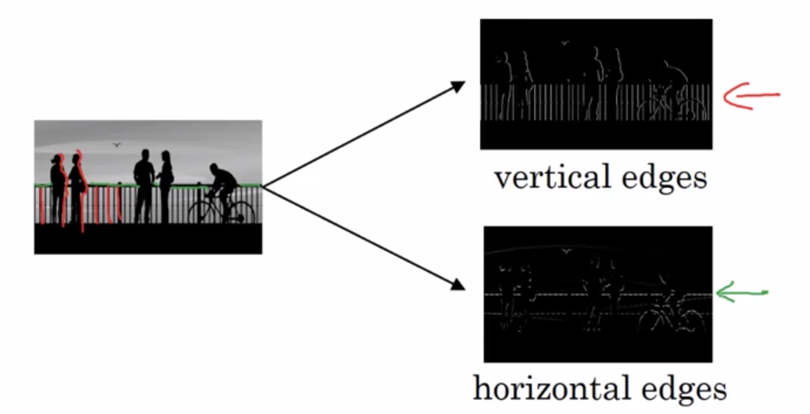
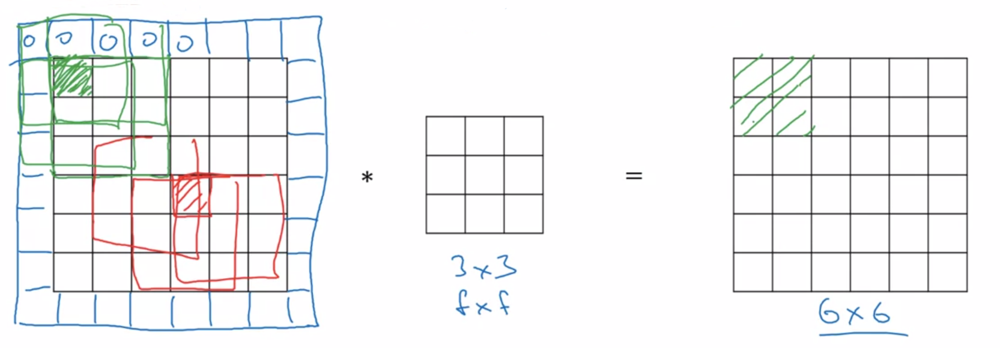
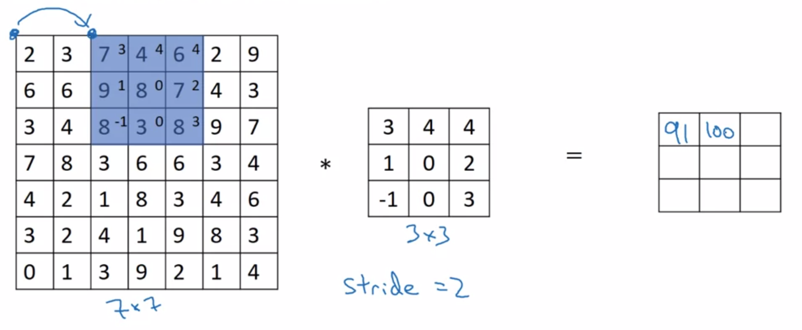
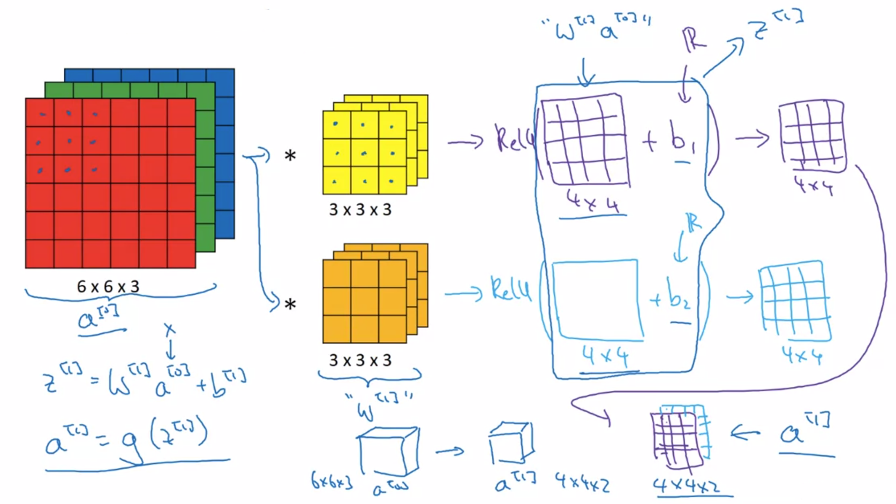

Deep Learning Specialization, Course D
**Convolutional Neural Networks** by deeplearning.ai, ***Andrew Ng,*** [Coursera]( https://www.coursera.org/learn/neural-networks-deep-learning/home/info)

***Week 1:*** *Foundations of Convolutional Neural Networks*

1. Understand the convolution operation
2. Understand the pooling operation
3. Remember the vocabulary used in convolutional neural network (padding, stride, filter, ...)
4. Build a convolutional neural network for image multi-class classification

<!-- more -->

### Convolutional Neural Networks

#### Computer Vision

large images → convolution operation

#### Edge Detection Example

##### Edges Detection

***Pooling:*** **convolution (cross-correlation),** *filter (kernel)*

#### More Edge Detection

$\begin{array}{cc|cc} \textsf{Vertical Edges Detection} & & & \textsf{Horizontal Edges Detection}_\strut \\ \left[ {\begin{matrix}1&0&-1\\1&0&-1\\1&0&-1 \end{matrix}} \right] & & & \left[ {\begin{matrix}1&1&1\\0&0&0\\ -1&-1&-1 \end{matrix}} \right] \\ \textsf{Sobel Filter} ^{\strut} \\ \left[ {\begin{matrix}1&0&-1\\2&0&-2\\1&0&-1 \end{matrix}} \right] & & & \left[ {\begin{matrix}1&2&1\\0&0&0\\ -1&-2&-1 \end{matrix}} \right] \\ \textsf{Scharr Filter} ^{\strut} \\ \left[ {\begin{matrix}3&0&-3\\10&0&-10\\3&0&-3 \end{matrix}} \right] & & & \left[ {\begin{matrix}3&10&3\\0&0&0\\ -3&-10&-3 \end{matrix}} \right] \end{array}$

**Learn as Parameters**

$\ast \left[ {\begin{matrix}w_1&w_2&w_3 \\ w_4&w_5&w_6 \\ w_7&w_8&w_9 \end{matrix}} \right]$

#### Padding

- shrink output (n-f+1 × n-f+1) → (n+2p-f+1 × n+2p-f+1)
- throw away info from edges

**Valid and Same convolution**  

- ***valid:*** no padding &emsp; $n \ast f \rightarrow n-f+1$
- ***same:*** pad so that output size is the same as the input size &emsp; $p=(f-1)/2$ &emsp; *(f is usually odd)*

#### Strided Convolutions

$n \ast f \xrightarrow{ {\rm padding}=p,\ {\rm stride}=s } \left\lfloor \dfrac{n+2p-f}{s}+1 \right\rfloor$

#### Convolutions Over Volume

$\Rightarrow \ n \times n \times n_{channel} \quad\ast\quad f \times f \times n_{channel} \quad=\quad n\\!\\!-\\!\\!f\\!\\!+\\!\\!1 \times n\\!\\!-\\!\\!f\\!\\!+\\!\\!1 \times n_{filter}$

#### One Layer of a Convolutional Network

- ***filter size:*** f[l]
- ***padding:*** p[l]
- ***stride:*** s[l]
- ***number of filters:*** nc[l]

- ***filter:*** f[l] × f[l] × nc[l-1]
- ***weights:*** f[l] × f[l] × nc[l-1] × nc[l]
- ***bias:*** 1 × 1× 1× nc[l]
- ***activations:*** nH[l] × nW[l] × nc[l]
- ***input:*** nH[l-1] × nW[l-1] × nc[l-1]
- ***output:*** *(m ×)* nH[l] × nW[l] × nc[l]  
  $\begin{aligned} n_H^{\left[l\right]} &= \left\lfloor \dfrac{n_H^{\left[l-1\right]} +2p^{\left[l\right]} -f^{\left[l\right]}} {s^{\left[l\right]}} +1 \right\rfloor ^{\strut} \\ n_W^{\left[l\right]} &= \left\lfloor \dfrac{n_W^{\left[l-1\right]} +2p^{\left[l\right]} -f^{\left[l\right]}} {s^{\left[l\right]}} +1 \right\rfloor ^{\strut} \end{aligned}$

#### Simple Convolutional Network Example

##### Types of Layers in a ConvNet

- **CONV:** convolution
- **POOL:** pooling
- **FC:** fully connected

#### Pooling Layers

##### Max Pooling

> *feature detected?*

perform the computation on each of the channels independently

##### Average Pooling

use average pooling to collapse representation

##### Hyperparameters

- ***f:*** filter size
- ***s:*** stride
- ***max / average***
- ~~***p:*** padding~~

**NO PARAMETERS TO LEARN**

#### CNN Example

|             | Activation Shape | Activation Size | \# Parameters |
| :---------: | :--------------: | :-------------: | :-----------: |
|  **INPUT**  |   (32, 32, 3)    |      3072       |       0       |
|  **CONV1**  |   (28, 28, 8)    |      3272       |      608      |
|  **POOL1**  |   (14, 14, 8)    |      1568       |       0       |
|  **CONV2**  |   (10, 10, 16)   |      1600       |     3216      |
|  **POOL2**  |    (5, 5, 16)    |       400       |       0       |
|   **FC3**   |     (120, 1)     |       120       |     48120     |
|   **FC4**   |     (84, 1)      |       84        |     10164     |
| **SOFTMAX** |     (10, 1)      |       10        |      850      |

#### Why Convolutions

- ***Parameter Sharing:*** a feature detector (such as edge detector) that is useful in one part of the image is probably useful in another part of the image
- ***Sparsity of Connections:*** in each layer, each output value depends on only a small number of inputs
- ***Translation Invariance:*** applying same filter to better capture the property of translation invariance

${\rm Cost} \ \ \begin{aligned} J = \dfrac{1}{m} \sum_{i=1}^{m} L\left(\hat{y}^{\left(i\right)},\,y^{\left(i\right)}\right) \end{aligned}$  
use gradient descent (or momentum, ...) to optimize parameters to reduce J

### Programming Assignments

#### Convolutional Model: step by step

#### Convolutional Model: application

<a href='https://github.com/bugstop/coursera-deep-learning-solutions' target="_blank">Solutions Manual</a>