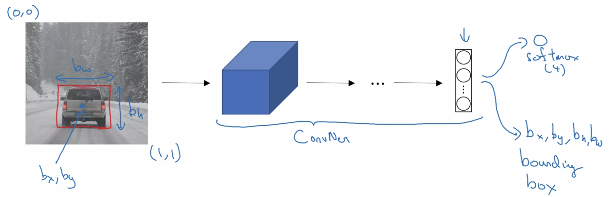
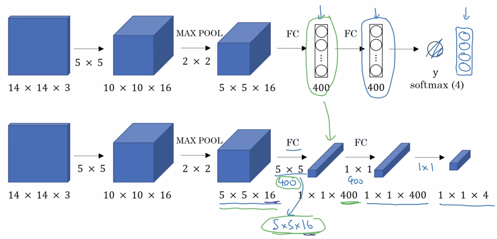
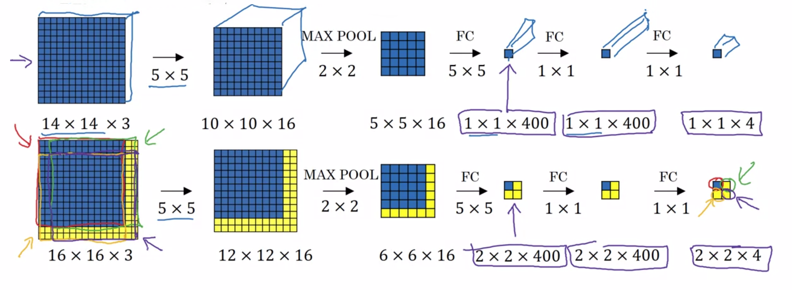
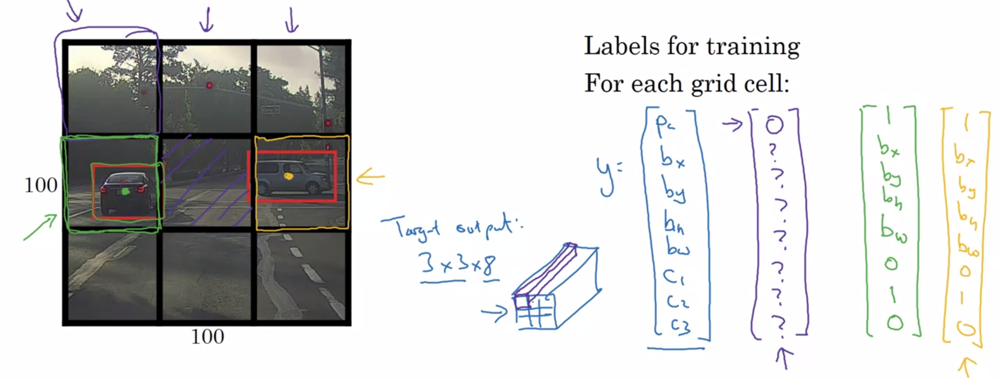
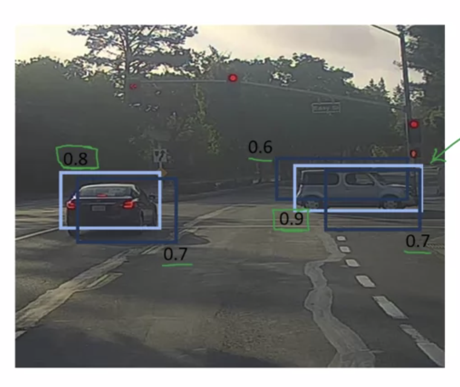
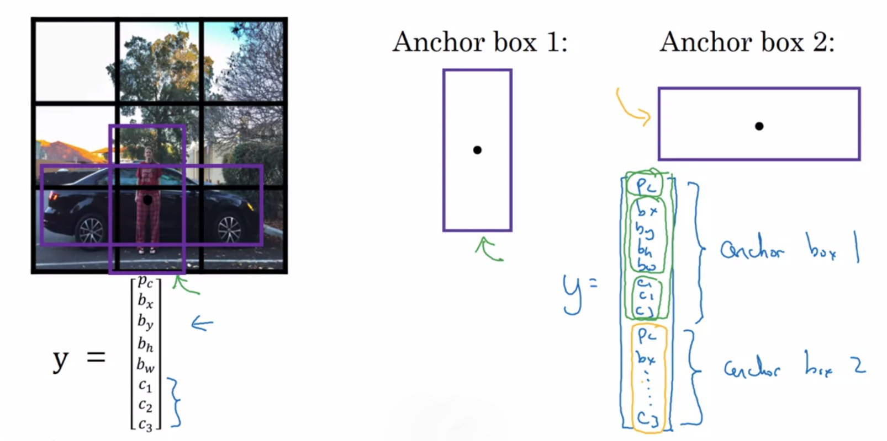
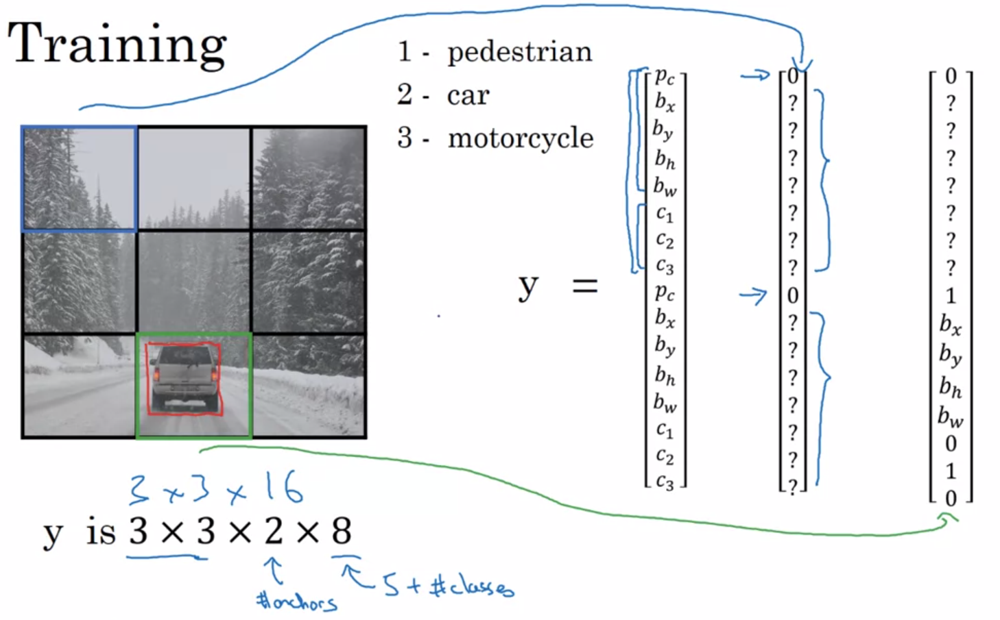

Deep Learning Specialization, Course D
**Convolutional Neural Networks** by deeplearning.ai, ***Andrew Ng,*** [Coursera]( https://www.coursera.org/learn/neural-networks-deep-learning/home/info)

***Week 3:*** *Object Detection*

1. Understand the challenges of Object Localization, Object Detection and Landmark Finding
2. Understand and implement non-max suppression
3. Understand and implement intersection over union
4. Understand how we label a dataset for an object detection application
5. Remember the vocabulary of object detection (landmark, anchor, bounding box, grid, ...)

<!-- more -->

### Detection Algorithms

#### Object Localization

image classification → classification with localization → detection

- is there any object?
- what is the size?
- what is the class?

$y = \left[\begin{matrix} p_c \\ b_x \\ b_y \\ b_h \\ b_w \\ c_1 \\ c_2 \\ c_3 \end{matrix}\right] \qquad y_{\rm car} = \left[\begin{matrix} 1 \\ 0.5 \\ 0.7 \\ 0.3 \\ 0.4 \\ 0 \\ 1 \\ 0 \end{matrix}\right] \qquad y_{\rm no\_obj} = \left[\begin{matrix} 0 \\ ? \\ ? \\ ? \\ ? \\ ? \\ ? \\ ? \end{matrix}\right]$

$L= \begin{cases} \left(\hat{y}_1-y_1\right)^2 + \left(\hat{y}_2-y_2\right)^2 + \dots + \left(\hat{y}_8-y_8\right)^2 \quad &{\rm if}\ \ y_1=1 \\ \left(\hat{y}_1-y_1\right)^2 &{\rm if}\ \ y_1=0 \end{cases}$

#### Landmark Detection

$y = \left[\begin{matrix} p_c \\ l_{1_x} \\ l_{1_y} \\ l_{2_x} \\ l_{2_y} \\ \vdots \end{matrix}\right]$

#### Object Detection

##### Sliding Window Detection

***computational cost***

#### Convolutional Implementation of Sliding Windows

#### Turning FC Layer into CONV Layers

##### Convolution Implementation of Sliding Windows

#### Bounding Box Predictions

##### YOLO Algorithm

*convolutional*

$b_x,\, b_y,\, b_h,\, b_w$ are specified relative to the grid cell

#### Intersection over Union

${\rm IoU}=\dfrac{\rm size \ of \ \cap}{\rm size \ of \ \cup} \geq 0.5 \Rightarrow {\rm correct} \ {\rm bounding} \ {\rm box}$

#### Non-Max Suppression

1. discard all boxes with pc < 0.6
2. while there are any remaining boxes
   - pick the box with the **largest pc** output as a **prediction**
   - **discard** any remaining box with **IoU ≥ 0.5** with the box output in the previous step
3. **independently** carry out non-max suppression on each of the outputs classes

#### Anchor Boxes

**Previously**
Each object in training image is assigned to grid cell that contains that object's midpoint

**With two (or more) anchor boxes**
Each object in training image is assigned to grid cell that contains that object's midpoint and anchor box for the grid cell with highest IoU

$y = \left[\begin{matrix} p_c \\ b_x \\ b_y \\ b_h \\ b_w \\ c_1 \\ c_2 \\ c_3 \\ p_c \\ b_x \\ b_y \\ b_h \\ b_w \\ c_1 \\ c_2 \\ c_3 \end{matrix}\right] \qquad y_{\rm car} = \left[\begin{matrix} 0 \\ ? \\ ? \\ ? \\ ? \\ ? \\ ? \\ ? \\ 1 \\ b_x \\ b_y \\ b_h \\ b_w \\ 0 \\ 1 \\ 0 \end{matrix}\right] \qquad y_{\rm man} = \left[\begin{matrix} 1 \\ b_x \\ b_y \\ b_h \\ b_w \\ 0 \\ 1 \\ 0 \\ 0 \\ ? \\ ? \\ ? \\ ? \\ ? \\ ? \\ ? \end{matrix}\right]  \qquad y_{\rm car\&man} = \left[\begin{matrix} 1 \\ b_x \\ b_y \\ b_h \\ b_w \\ 0 \\ 1 \\ 0 \\ 1 \\ b_x \\ b_y \\ b_h \\ b_w \\ 0 \\ 1 \\ 0 \end{matrix}\right]$

#### YOLO Algorithm

1. for each grid cell, get two predicted bounding boxes
2. get rid of low probability predictions
3. for each class, use non-max suppression to generate final predictions

#### Region Proposals (R-CNN)

**segmentation algorithm**

### Programming Assignments

#### Car detection with YOLO

<a href='https://github.com/bugstop/coursera-deep-learning-solutions' target="_blank">Solutions Manual</a>