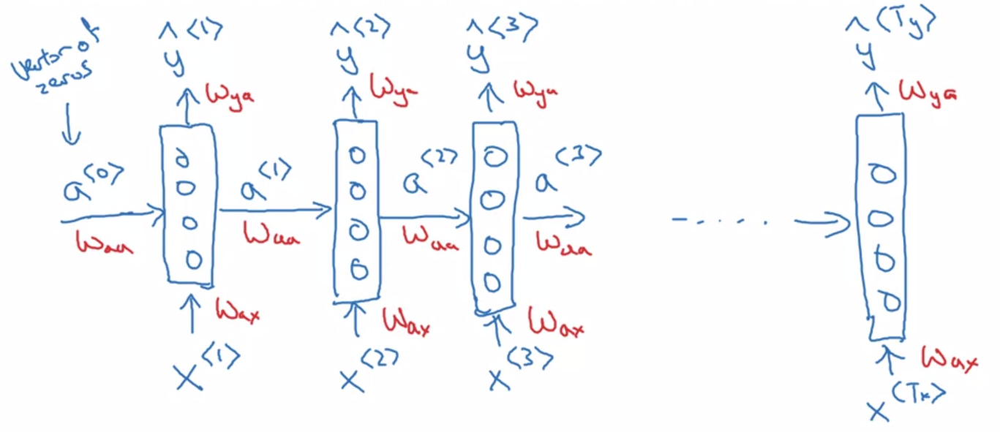
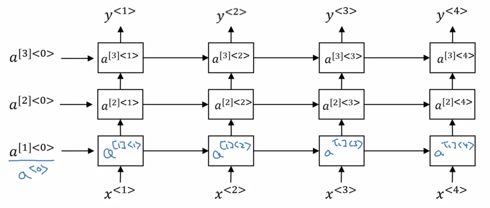

Deep Learning Specialization, Course E
**Sequence Models** by deeplearning.ai, ***Andrew Ng,*** [Coursera]( https://www.coursera.org/learn/neural-networks-deep-learning/home/info)

***Week 1:*** *Recurrent Neural Networks*

1. Learn about recurrent neural networks. This type of model has been proven to perform extremely well on temporal data. It has several variants including LSTMs, GRUs and Bidirectional RNNs, which you are going to learn about in this section.

<!-- more -->

### Recurrent Neural Networks

#### Notation

- ***x:*** x&lt;1>, x&lt;2>, x&lt;3>, ..., x&lt;t>, ..., x&lt;9>,   Tx = 9
  *Harry Potter and Hermione Granger invented a new spell.*
- ***y:*** y&lt;1>, y&lt;2>, y&lt;3>, ..., y&lt;t>, ..., y&lt;9>,   Ty = 9
  named-entity recognition: *1 1 0 1 1 0 0 0 0*

$\begin{matrix} \qquad \textit{x:} & \textsf{Harry} & \textsf{Potter} & \textsf{and} & \textsf{Hermione} & \textsf{Granger} & \textsf{invented} & \textsf{a} & \textsf{new} & \textsf{spell} \\ & x^{\left\lt 1\right\gt } & x^{\left\lt 2\right\gt } & x^{\left\lt 3\right\gt } & x^{\left\lt 4\right\gt } & x^{\left\lt 5\right\gt } & x^{\left\lt 6\right\gt } & x^{\left\lt 7\right\gt } & x^{\left\lt 8\right\gt } & x^{\left\lt 9\right\gt } \\ {\rm Vocabulary} & \downarrow & \downarrow & \downarrow & \large{\rm one \ hot}  &&&&& \\ \left[\begin{matrix} \rm a \\ \rm aaron \\ \vdots \\ \rm and \\ \vdots \\ \rm harry \\ \vdots \\ \rm potter \\ \vdots \\ \rm zulu \end{matrix}\right] & \left[\begin{matrix} 0 \\ 0 \\ \vdots \\ 0 \\ \vdots \\ 1 \\ \vdots \\ 0 \\ \vdots \\ 0 \end{matrix}\right] & \left[\begin{matrix} 0 \\ 0 \\ \vdots \\ 0 \\ \vdots \\ 0 \\ \vdots \\ 1 \\ \vdots \\ 0 \end{matrix}\right] & \left[\begin{matrix} 0 \\ 0 \\ \vdots \\ 1 \\ \vdots \\ 0 \\ \vdots \\ 0 \\ \vdots \\ 0 \end{matrix}\right] & \cdots & \cdots \end{matrix}$

use a new fake word **&lt;UNK>** to represent words not in the vocabulary
use a toke **&lt;EOS>** to represent the end of every sentence

#### Recurrent Neural Network Model

**Why not a standard network**

- inputs and outputs can be different lengths in different examples
- does not share features learned across different positions of text

**Recurrent Neural Network**

***limitation:*** not using information later in the sequence → BRNN (Bidirectional Recurrent Neural Network)

##### Forward Propagation

$\begin{aligned}a^{\left\lt 0\right\gt } &= \overrightarrow {0} _{\strut} \\ a^{\left\lt 1\right\gt } &= g\left( W_{aa} a^{\left\lt 0\right\gt } + W_{ax} x^{\left\lt 1\right\gt } +b_a \right) &{\rm tanh / ReLU} \\ \hat{y}^{\left\lt 1\right\gt } &= g\left( W_{ya} a^{\left\lt 1\right\gt } +b_y \right) &{\rm sigmoid / softmax} \\ &\ \ \vdots \\ a^{\left\lt t\right\gt } &= g\left( W_{aa} a^{\left\lt t-1\right\gt } + W_{ax} x^{\left\lt t\right\gt } +b_a \right) \\ &= g\left( W_{a} \left[ a^{\left\lt t-1\right\gt }, x^{\left\lt t\right\gt } \right] +b_a \right) & W_a &= \left[ \begin{array}{c|c} W_{aa} & W_{ax} \end{array} \right] \\ \hat{y}^{\left\lt t\right\gt } &= g\left( W_{ya} a^{\left\lt t\right\gt } +b_y \right) = g\left( W_{y} a^{\left\lt t\right\gt } +b_y \right) & \left[ a^{\left\lt t-1\right\gt }, x^{\left\lt t\right\gt } \right] &= \left[ \begin{array}{c} a^{\left\lt t-1\right\gt } \\ \hline x^{\left\lt t\right\gt } \end{array} \right] \end{aligned}$

#### Backpropagation Through Time

$\begin{aligned} & L^{\left\lt t\right\gt } \left( \hat{y}^{\left\lt t\right\gt }, y^{\left\lt t\right\gt } \right) = -{y}^{\left\lt t\right\gt } \log \hat{y}^{\left\lt t\right\gt } - \left(1-{y}^{\left\lt t\right\gt } \right) \log \left( 1- \hat{y}^{\left\lt t\right\gt } \right) \\ & L \left( \hat{y}, y\right) = \sum_{t=1}^{T_y} L^{\left\lt t\right\gt } \left( \hat{y}^{\left\lt t\right\gt }, y^{\left\lt t\right\gt } \right)  \end{aligned}$

#### Different Types of RNNs

- many-to-many architecture
- many-to-one architecture
- one-to-many architecture
- one-to-one architecture
- many-to-many architecture *(different length)*

#### Language Model and Sequence Generation

$P\left( y^{\left\lt 1\right\gt }, y^{\left\lt 2\right\gt }, \dots, y^{\left\lt T_y\right\gt }\right)$

- ***training set:*** large corpus of text

$\begin{aligned} & L^{\left\lt t\right\gt } \left( \hat{y}^{\left\lt t\right\gt }, y^{\left\lt t\right\gt } \right) = - \sum_i {y}^{\left\lt t\right\gt }_i \log \hat{y}^{\left\lt t\right\gt } _i \\ & L \left( \hat{y}, y\right) = \sum_t L^{\left\lt t\right\gt } \left( \hat{y}^{\left\lt t\right\gt }, y^{\left\lt t\right\gt } \right)  \end{aligned}$

#### Sampling Novel Sequences

#### Vanishing Gradients with RNNs

$\xleftarrow{\textrm{The}\ cat\ \textrm{which ... ...} \ was\ \textrm{full.}}$
$\xleftarrow{\textrm{The}\ cats\ \textrm{which ... ...} \ were\ \textrm{full.}}$

#### Gated Recurrent Unit (GRU)

$a ^{\left\lt t\right\gt } = \tanh \left( W_{a} \left[ a^{\left\lt t-1\right\gt }, x^{\left\lt t\right\gt } \right] +b_a \right)$

##### Simplified GRU

- ***c:*** memory cell, c&lt;t> = a&lt;t>

$\begin{aligned} \tilde{c} ^{\left\lt t\right\gt } &= \tanh \left( W_{c} \left[ c^{\left\lt t-1\right\gt }, x^{\left\lt t\right\gt } \right] +b_c \right) \\ \Gamma_u &= {\rm sigmoid} \left( W_u \left[ c^{\left\lt t-1\right\gt }, x^{\left\lt t\right\gt } \right] +b_u \right) & {\approx 0 \ {\rm or} \ 1} \quad \textsf{Gate: update?} \\ c^{\left\lt t\right\gt } &= \Gamma_u \odot \tilde{c}^{\left\lt t\right\gt }  + \left(1-\Gamma_u\right) \odot c^{\left\lt t-1\right\gt } \qquad & \textsf{element-wise multiplication} \end{aligned}$

##### Full GRU

$\begin{aligned} \tilde{c} ^{\left\lt t\right\gt } &= \tanh \left( W_{c} \left[ \Gamma_r \odot c^{\left\lt t-1\right\gt }, x^{\left\lt t\right\gt } \right] +b_c \right) \\ \Gamma_u &= {\rm sigmoid} \left( W_u \left[ c^{\left\lt t-1\right\gt }, x^{\left\lt t\right\gt } \right] +b_u \right) \\ \Gamma_r &= {\rm sigmoid} \left( W_r \left[ c^{\left\lt t-1\right\gt }, x^{\left\lt t\right\gt } \right] +b_r \right) \\ c^{\left\lt t\right\gt } &= \Gamma_u \odot \tilde{c}^{\left\lt t\right\gt } + \left(1-\Gamma_u\right) \odot c^{\left\lt t-1\right\gt } \\ {a} ^{\left\lt t\right\gt } &= {c} ^{\left\lt t\right\gt } \end{aligned}$

#### Long Short Term Memory (LSTM)

$\begin{aligned} \tilde{c} ^{\left\lt t\right\gt } &= \tanh \left( W_{c} \left[ a^{\left\lt t-1\right\gt }, x^{\left\lt t\right\gt } \right] +b_c \right) \\ \Gamma_u &= {\rm sigmoid} \left( W_u \left[ a^{\left\lt t-1\right\gt }, x^{\left\lt t\right\gt } \right] +b_u \right) & \textsf{update gate} \\ \Gamma_f &= {\rm sigmoid} \left( W_f \left[ a^{\left\lt t-1\right\gt }, x^{\left\lt t\right\gt } \right] +b_f \right) & \textsf{forget gate} \\ \Gamma_o &= {\rm sigmoid} \left( W_o \left[ a^{\left\lt t-1\right\gt }, x^{\left\lt t\right\gt } \right] +b_o \right) & \textsf{output gate} \\ c^{\left\lt t\right\gt } &= \Gamma_u \odot \tilde{c}^{\left\lt t\right\gt } + \Gamma_f \odot c^{\left\lt t-1\right\gt } \\ {a} ^{\left\lt t\right\gt } &= \Gamma_o \odot \tanh \left( {c} ^{\left\lt t\right\gt } \right) \end{aligned}$

#### Bidirectional RNN (BRNN)

**Acyclic Graph**

$\hat{y}^{\left\lt t\right\gt } = g\left( W_y \left[ \overrightarrow {a}^{\left\lt t\right\gt } , \overleftarrow {a}^{\left\lt t\right\gt } \right] +b_y\right)$

#### Deep RNNs

### Programming Assignments

#### Building a Recurrent Neural Network - step by step

#### Dinosaur Island - Character-Level Language Modeling

#### Jazz Improvisation with LSTM

<a href='https://github.com/bugstop/coursera-deep-learning-solutions' target="_blank">Solutions Manual</a>