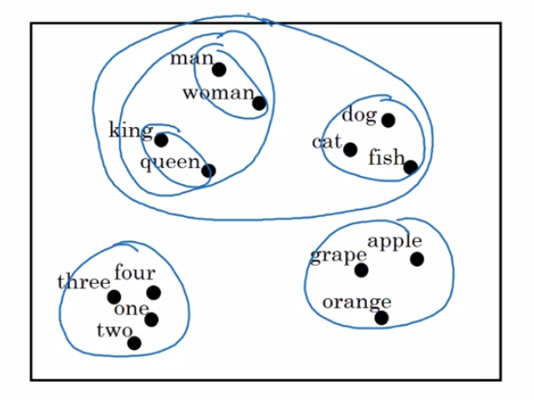
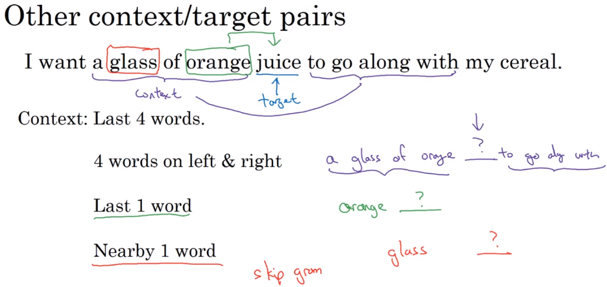
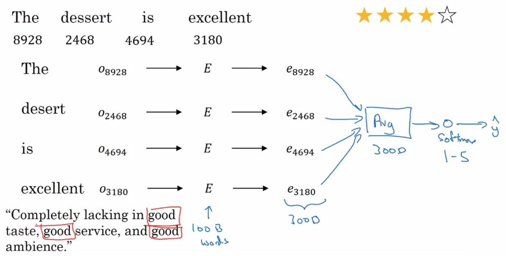
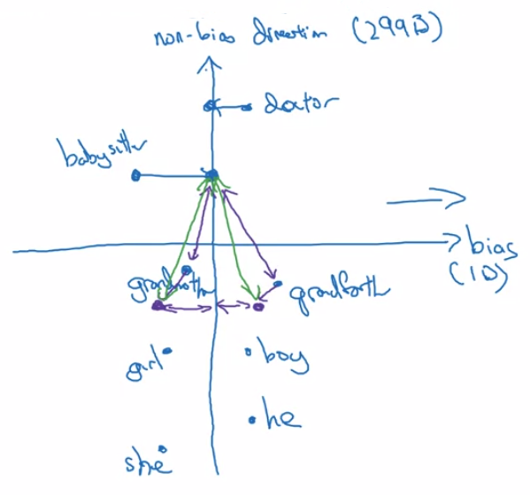

Deep Learning Specialization, Course E
**Sequence Models** by deeplearning.ai, ***Andrew Ng,*** [Coursera]( https://www.coursera.org/learn/neural-networks-deep-learning/home/info)

***Week 2:*** *Natural Language Processing & Word Embeddings*

1. Natural language processing with deep learning is an important combination. Using word vector representations and embedding layers you can train recurrent neural networks with outstanding performances in a wide variety of industries. Examples of applications are sentiment analysis, named entity recognition and machine translation.

<!-- more -->

### Introduction to Word Embeddings

#### Word Representation

*the inner product between any two different **one-hot** vector is zero*

##### t-SNE

visualize word embeddings

#### Using Word Embeddings

1. Learning word embeddings from large text corpus, or download pretrained embedding online. *(1-100B words)*
2. Transfer embedding to new task with smaller training set. *(~100k words)*
3. *Optional:* Continue to finetune the word embeddings with new data.

#### Properties of Word Embeddings

$\begin{aligned}& \\!\\!\\!\\!\\! \textsf{Man} \rightarrow \textsf{Woman  as  King} \rightarrow \underline{\rm Queen} \\ e_{man} &- e_{woman} \approx \left[\begin{matrix} -2\\0\\0\\0 \end{matrix}\right] \approx e_{king} - e_{queen} \end{aligned}$

find word w: ${\rm argmax}\ {\rm sim} \left(e_w, \ e_{king} - e_{man} + e_{woman} \right) \qquad {\rm sim}\left(u,v\right) = \dfrac{u^{\mathsf{T}}v} {\left\|u\right\|_2\left\|v\right\|_2}$

#### Embedding Matrix

- ***E:*** embedding matrix
- ***o:*** one-hot vector
- ***e:*** embedding vector

$E_{300\times10000}\cdot o_{10000\times1} = \left[\begin{matrix} a&aaron&\cdots&orange&\cdots&zulu \\ \\ \\ &&&E \\ \\ \\ \end{matrix}\right] \left[\begin{matrix} 0\\0\\\vdots\\1\\\vdots\\0 \end{matrix}\right] = e_{300\times1} $

*use embedding layer to call out the column instead of a matrix vector multiplication*

### Learning Word Embeddings: Word2Vec & GloVe

#### Learning Word Embeddings

#### Word2Vec

##### Skip Grams

$\begin{aligned} & \Rightarrow \quad \textrm{I want a glass of orange juice to go along with my cereal.} \\ & \qquad\qquad \begin{matrix} \textsf{context} & orange & orange & orange & \cdots && \\ \textsf{target} & juice & glass & my & \cdots && \textsf{randomly picked within some window} \end{matrix} \\ & \Rightarrow \quad {\rm Context} \ c \rightarrow {\rm Target} \ t \quad \Rightarrow \quad o_c \rightarrow E \rightarrow e_c \rightarrow {\rm softmax} \rightarrow \hat{y} \\ & \qquad\qquad {\rm softmax} \ p\left(t|c\right) = \dfrac{e^{\theta_t^{\mathsf{T}} e_c}}{\sum_j e^{\theta_j^{\mathsf{T}} e_c}} \qquad \theta_t \textsf{: parameter associated with output } t \\ & \qquad\qquad {\rm Loss} \ L\left(\hat{y},y\right) = -\sum_i y_i \log \hat{y}_i \end{aligned}$

**Problems**

- ***softmax is slow***

  - hierarchical softmax classifier

    

- ***how to sample the context c***

  - uniformly random → *the, of, a, and, to, ...*
  - **heuristics**

#### Negative Sampling

**Generate Negative Samples**
pick ***k*** target words from the dictionary ***randomly*** and label all those ***0***

$P\left(\omega_i\right) = \dfrac{f\left(\omega_i\right)^{3/4}}{\sum_j f\left(\omega_j\right)^{3/4}} \qquad f \textsf{: frequency of word}$

$\begin{matrix} \rm context & \rm word & \rm target? \\ orange & juice & 1 \\ orange & king & 0 \\ orange & the & 0 \\ \vdots & \vdots & \vdots \\ orange & of & 0 \\ c&t&y \end{matrix}$

$\begin{aligned} \Downarrow \quad p\left(t|c\right) &= \dfrac{e^{\theta_t^{\mathsf{T}} e_c}}{\sum_j e^{\theta_j^{\mathsf{T}} e_c}} \qquad & \textsf{compute 10000-way softmax function} \\ p\left(y=1|c,t\right) &= {\rm sigmoid} \left( \theta_t^{\mathsf{T}} e_c \right) & \textsf{k out of 10000 binary classifications} \end{aligned}$

#### GloVe Word Vectors

**Global Vectors for Word Representation**

$\begin{aligned} X_{ij} &= \textrm{number of times } j \textrm{ appears in context of } i \qquad \textit{( i: c ,  j: t )} \\ X_{ji} &= X_{ij} \end{aligned}$

$\begin{aligned} {\rm minimize} \ & \sum_i \sum_j f\left(X_{ij}\right) \left( \theta_i^{\mathsf{T}} e_j +b_i +b'_j -\log X_{ij} \right) ^2 \\ \cdot \ & \textsf{weighting term } f\left(X_{ij}\right) = 0 \quad {\rm if} \quad X_{ij}=0 , \qquad 0\log0=0 \\ &\qquad \textsf{also deal with stop words (is, of, a), and weigh less frequent words} \\ \cdot \ & \theta_i,\, e_j\textsf{ are symmetric} \end{aligned}$

### Applications Using Word Embeddings

#### Sentiment Classification

***small training sets***

#### Debiasing Word Embeddings

- Man: Woman as King: Queen
- Man: Computer_Programmer as Woman: Homemaker
- Father: Doctor as Mother: Nurse

*Word embeddings can reflect gender, ethnicity, age, sexual orientation, and other biases of the text used to train the model.*

1. **Identify bias direction.**

   ${\rm average} \begin{cases}e_{he}-e_{she} \\ e_{male}-e_{female} \\\cdots \end{cases} \qquad$*( SVU, singular value decomposition )*

2. **Neutralize: for every word that is not definitional, project to get rid of bias.**

3. **Equalize pairs.**

### Programming Assignments

#### Operations on Word Vectors - Debiasing

#### Emojify

<a href='https://github.com/bugstop/coursera-deep-learning-solutions' target="_blank">Solutions Manual</a>