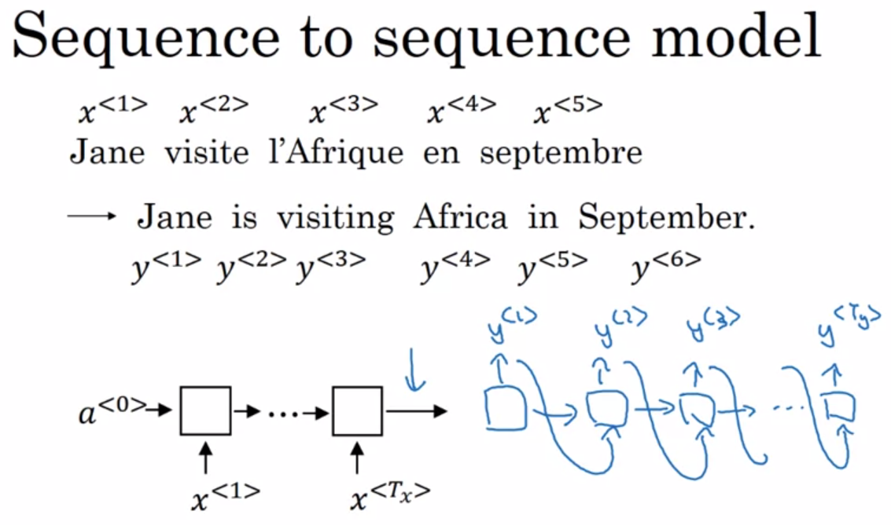
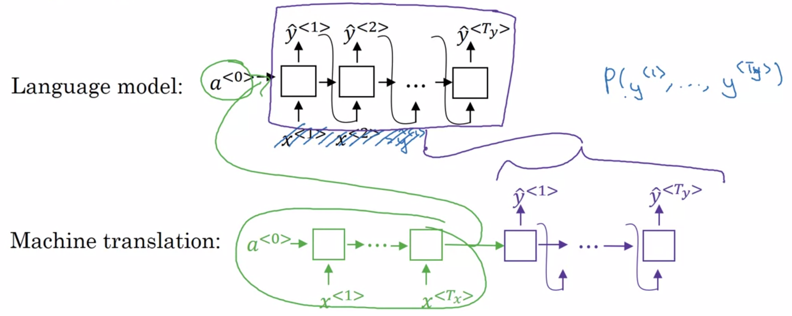
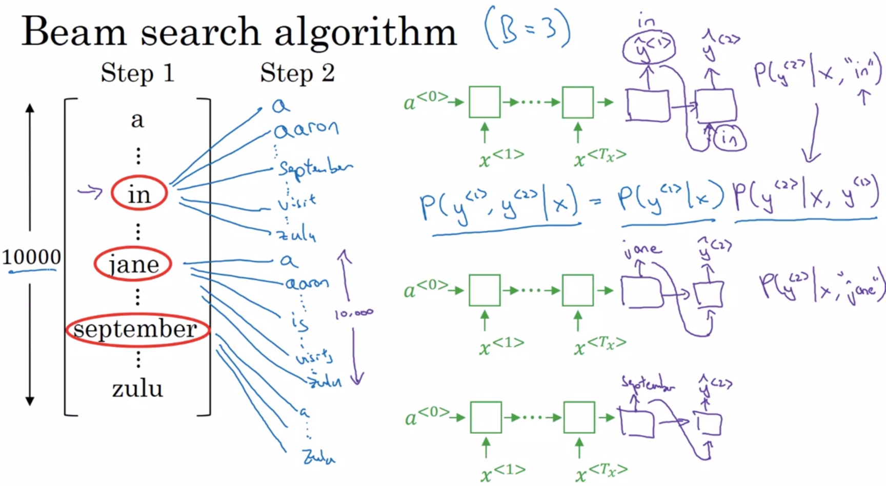
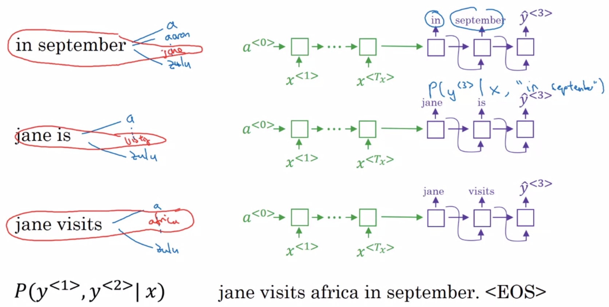
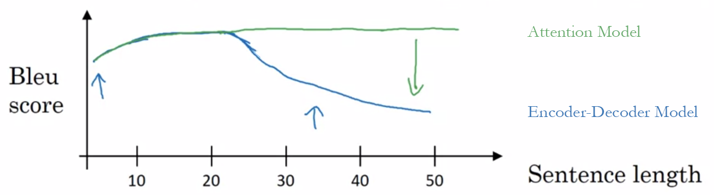
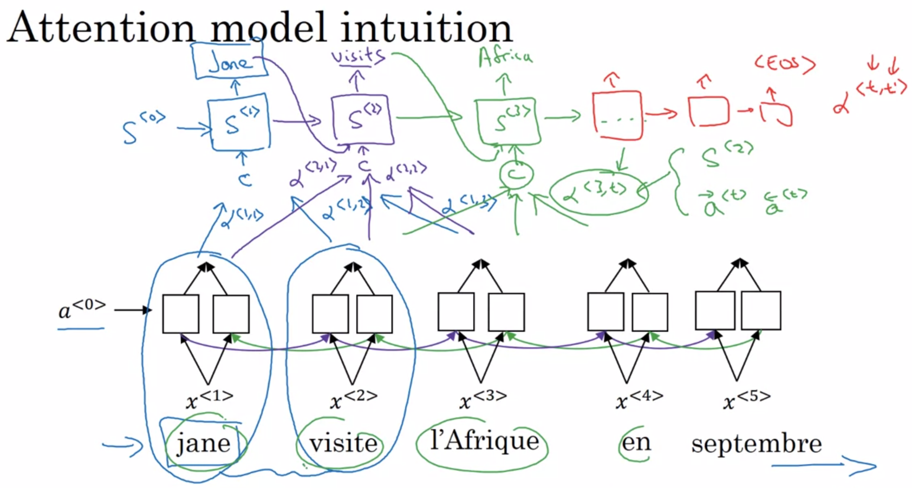
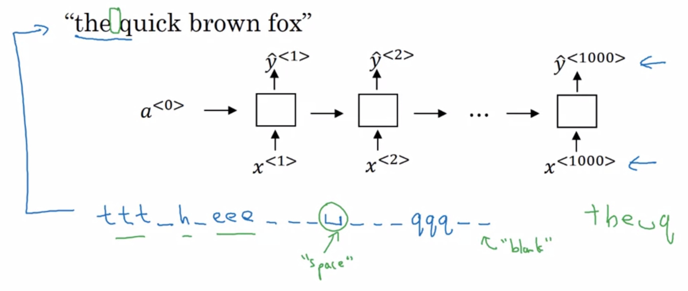
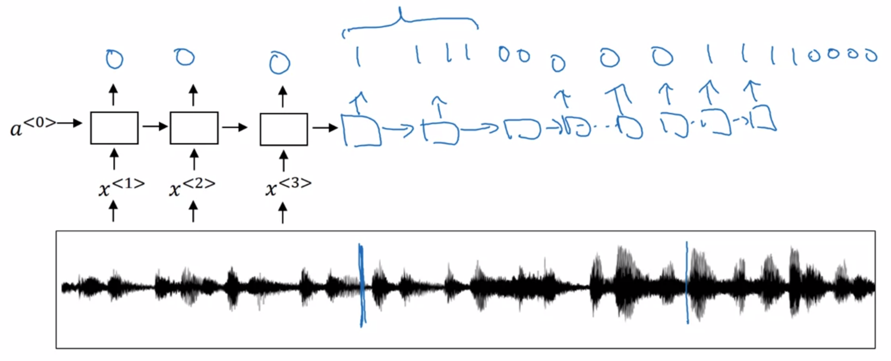

Deep Learning Specialization, Course E
**Sequence Models** by deeplearning.ai, ***Andrew Ng,*** [Coursera]( https://www.coursera.org/learn/neural-networks-deep-learning/home/info)

***Week 3:*** *Sequence Models & Attention Mechanism*

1. Sequence models can be augmented using an attention mechanism. This algorithm will help your model understand where it should focus its attention given a sequence of inputs. This week, you will also learn about speech recognition and how to deal with audio data.

<!-- more -->

### Various Sequence to Sequence Architectures

#### Basic Models

#### Picking the Most Likely Sentence

**Conditional Language Model**

$P\left(y^{\left\lt 1 \right\gt},\,\dots,\,y^{\left\lt T_y \right\gt} | x^{\left\lt 1 \right\gt},\,\dots,\, x^{\left\lt T_x \right\gt}\right)$

${\rm argmax}_{y^{\left\lt 1 \right\gt},\,\dots,\,y^{\left\lt T_y \right\gt}} P\left(y^{\left\lt 1 \right\gt},\,\dots,\,y^{\left\lt T_y \right\gt} | x\right)$

#### Beam Search

#### Refinements to Beam Search

##### Length Normalization

$\begin{aligned} & {\rm argmax}_y \prod_{t=1}^{T_y}  P\left(y^{\left\lt t \right\gt} | x,\,y^{\left\lt 1 \right\gt},\,\dots,\, y^{\left\lt t-1 \right\gt}\right) & \textsf{ numerical underflow} \\ \Rightarrow \ & {\rm argmax}_y \sum_{t=1}^{T_y} \log P\left(y^{\left\lt t \right\gt} | x,\,y^{\left\lt 1 \right\gt},\,\dots,\, y^{\left\lt t-1 \right\gt}\right) & \textsf{short sentences} \\ \Rightarrow \ & {\rm argmax}_y \dfrac{1}{T_y^{\,\alpha}} \sum_{t=1}^{T_y} \log P\left(y^{\left\lt t \right\gt} | x,\,y^{\left\lt 1 \right\gt},\,\dots,\, y^{\left\lt t-1 \right\gt}\right) & \alpha \sim 0.7 \qquad \qquad \qquad \end{aligned}$

- ***Beam Width***
  - large B: better result, slower
  - small B: worse result, faster

#### Error Analysis in Beam Search

- **Jane visite l'Afrique en septembre.** $\quad x$

  - ***Human:*** Jane visits Africa in September. $\quad y^\star$
  - ***Algorithm:***  Jane visited Africa last September. $\quad \hat{y}$

- **RNN / Bean Search**

  - RNN computes $P\left(y|x\right)$

    $\begin{cases}\begin{aligned} P\left(y^\star|x\right) &> P\left(\hat{y}|x\right) & \textsf{beam search is at fault} \\ P\left(y^\star|x\right) &\leq P\left(\hat{y}|x\right) & \textsf{RNN model is at fault} \end{aligned}\end{cases}$

  - Figure out what faction of errors are due to beam search vs RNN model

#### Bleu Score

**Bilingual Evolution Understudy**

- **Le chat est sur le tapis.**

  - ***Reference 1:*** **The** cat is on **the** mat.

  - ***Reference 2:*** There is a cat on **the** mat.

  - ***Machine Translation 1:*** The the the the the the the.

    - Precision

      $\dfrac{\textsf{appear in reference}}{\textsf{word count}} = \dfrac{7}{7}$

    - Modified Precision

      $\dfrac{\textsf{max count in reference}}{\textsf{Count(the)}} = \dfrac{\textsf{Count}_{\textsf{clip}}\textsf{(the)}}{\textsf{Count(the)}} = \dfrac{2}{7}$

  - ***Machine Translation 2:*** The cat the cat on the mat.

    - Bigrams Modified Precision

      $\begin{matrix} & \textsf{Count} & \textsf{Count}_{\textsf{clip}} & \\ \textrm{the cat} &2&1& \\ \textrm{cat the} &1&0& \\ \textrm{cat on} &1&1& \\ \textrm{on the} &1&1& \\ \textrm{the mat} &1&1& \\ &6&4& P = 4/6  \end{matrix}$

$\begin{aligned} & \textsf{unigram}_{\strut} \\ P_1 &= \dfrac{\displaystyle\sum_{\textrm{unigram} \in\hat{y}} \textsf{Count}_{\textsf{clip}} \left(\textrm{unigram}\right)} {\displaystyle\sum_{\textrm{unigram} \in\hat{y}} \textsf{Count} \left(\textrm{unigram}\right)} \\\\ & \textsf{n-gram}_{\strut} \\ P_n &= \dfrac{\displaystyle\sum_{\textrm{n-gram} \in\hat{y}} \textsf{Count}_{\textsf{clip}} \left(\textrm{n-gram}\right)} {\displaystyle\sum_{\textrm{n-gram} \in\hat{y}} \textsf{Count} \left(\textrm{n-gram}\right)} \\\\ & \textsf{combined bleu score}_{\strut} \\ P &= {\rm BP} \exp \left( \dfrac{1}{4} \sum_n P_n \right) \\ & \textrm{BP: brevity penalty} \\ {\rm BP} &= \begin{cases} 1 & \textrm{if  MT_length > REF_length} \\ \exp \left(1- \dfrac{\textrm{REF_length}}{\textrm{MT_length}}\right) \quad & \textrm{otherwise} \end{cases}\end{aligned}$

#### Attention Model Intuition

#### Attention Model

$\begin{aligned} & a ^{\left\lt t' \right\gt} = \left( \overrightarrow {a}^{\left\lt t' \right\gt}, \ \overleftarrow {a}^{\left\lt t' \right\gt} \right) \\ & \begin{aligned} \sum_{t'} {\alpha} ^{\left\lt 1,\,t' \right\gt} = 1 \qquad & {\alpha} ^{\left\lt t,\,t' \right\gt} \textsf{ is the amount of "attention" } y  ^{\left\lt t \right\gt} \textsf{ should pay to } a^{\left\lt t' \right\gt} \\ & {\alpha} ^{\left\lt t,\,t' \right\gt} = \dfrac{\exp \left( e^{\left\lt t,\,t' \right\gt} \right)} {\sum_{t'=1}^{T_x} \exp \left( e^{\left\lt t,\,t' \right\gt} \right)} \end{aligned} \\ \Rightarrow \ & c ^{\left\lt 1 \right\gt} = \sum_{t'} {\alpha} ^{\left\lt 1,\,t' \right\gt} a ^{\left\lt t' \right\gt} \end{aligned}$

***quadratic time / cost***

### Speech recognition - Audio data

#### Speech Recognition

audio → frequency → end-to-end deep neuron network

##### CTC (Connectionist Temporal Classification)

*collapse repeated characters not separated by "blank"*

#### Trigger Word Detection

### Programming Assignments

#### Neural Machine Translation with Attention

#### Trigger word detection

<a href='https://github.com/bugstop/coursera-deep-learning-solutions' target="_blank">Solutions Manual</a>